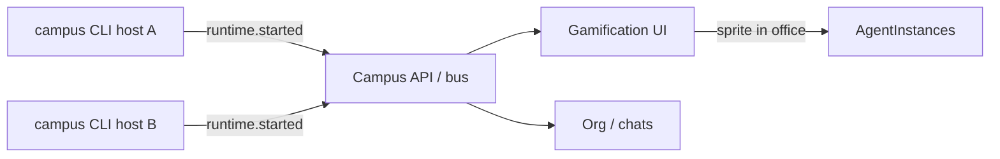
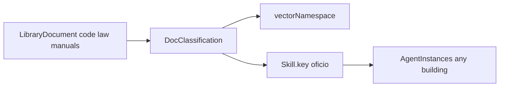
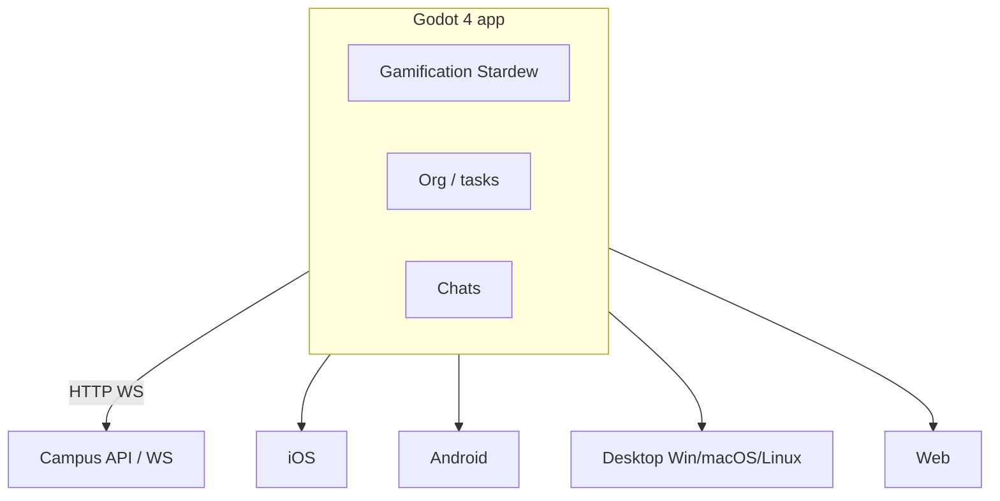
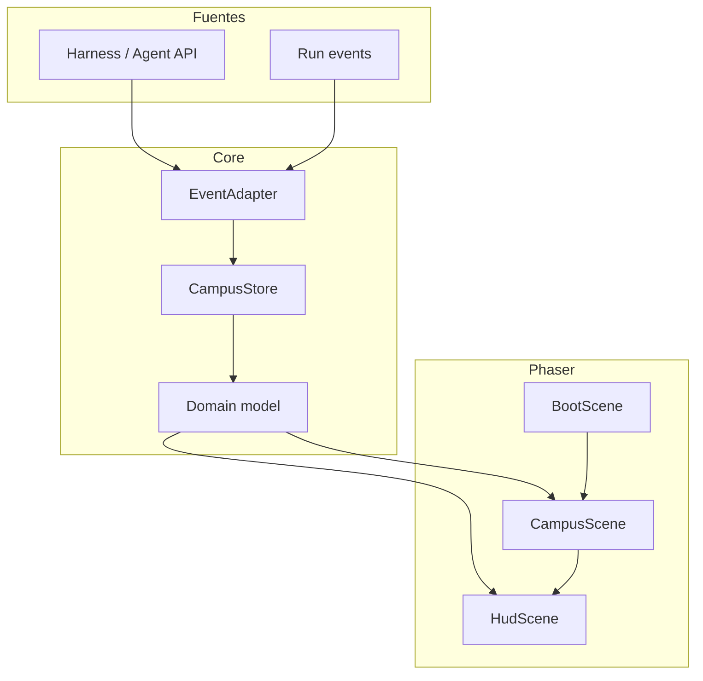
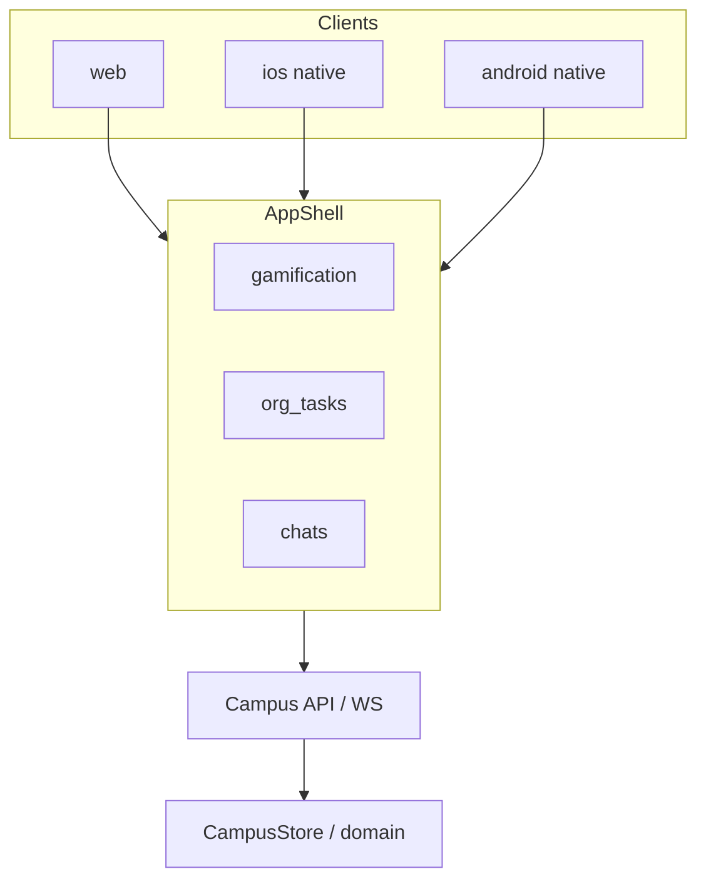

# Agent Campus — Spec técnica (engine)

**Estado:** v0.16 — **Godot 4 = cliente principal**: mobile (iOS/Android) + **desktop** (Windows/macOS/Linux) + web.  
**Cliente principal:** **Godot 4** (Stardew-like + UI org/chats).  
**Targets:** iOS · Android · **Desktop** · Web — un solo proyecto `.godot`.  
**Backend:** dominio TS + API Hono + MemPalace + Spec Kit + Compose.  
**CLI host:** diferido (prioridad baja).  
**Referencia visual:** Stardew-like; refs en `assets/refs/`.

---

## 1. Objetivo

Producto con **tres ámbitos / pantallas** (en **web y mobile nativo**):

1. **Gamificación** — mapa campus; workers anónimos entrar/salir.
2. **Organigrama / tareas** — mindmap; inventario; órdenes.
3. **Chats con agentes** — hilos con instancias nombradas.

Dominio compartido: campus → edificios → oficinas; `ProjectCall`; biblioteca; workers; MemPalace; Spec Kit; **hosts CLI** que hacen vivir agentes en máquinas remotas y los **representan** en su oficina.

### CLI host distribuido (`campus`) — prioridad baja

> **Prioridad baja.** El contrato existe (`domain/host.ts`) para no pintar una esquina, pero **no bloquea** scaffold de web/mobile, memoria, Spec Kit ni compose. Se implementa después del MVP de pantallas + API.

El sistema permitirá **instalar un CLI** en cualquier máquina para:

1. **Conectarse** al campus (`campus login` / `host join`).
2. **Instanciar** agentes con rol/oficio/harness (`agent spawn`).
3. **Mantenerlos vivos** (proceso runtime en esa máquina).
4. **Representarlos** en el mapa/org en su lugar justo (oficina natural / building).



| Concepto | Tipo | Notas |
|---|---|---|
| Host | `AgentHost` | Máquina/proceso unido al campus |
| Runtime | `AgentRuntime` | Proceso vivo de un `AgentInstance` en un host |
| Representación | `hostId` + `runtimeId` en la instancia | Mapa coloca el sprite en la oficina del rol |
| Plataforma | `ClientPlatform = "cli_host"` | Junto a web/ios/android |

Comandos (contrato): ver `CAMPUS_CLI_COMMANDS` en [`domain/host.ts`](../packages/campus-engine/src/domain/host.ts).

Eventos: `host.joined` / `host.left` / `host.heartbeat` / `runtime.started` / `runtime.stopped`.

Reglas:

- Un agente **vivo** tiene `runtimeId` + `hostId`; sin runtime aparece offline / no “habita” la oficina.
- Spawn respeta catálogo, rank, homing y `ProjectCall` igual que desde la UI.
- Varios hosts pueden correr roles distintos (p. ej. GPU box = systems eng; laptop = UX).
- Al caer el host: `runtime.stopped` → sprites salen o pasan a idle offline (TBD visual).
- Workers anónimos también pueden spawnearse desde un host `ic` y verse entrar/salir.

### Clientes: Godot-first (mobile + desktop + web)

| Plataforma | Cómo |
|---|---|
| **iOS / Android** | Export nativo Godot → stores |
| **Desktop** | Export nativo Godot → **Windows / macOS / Linux** |
| **Web** | Export HTML5/WASM del mismo proyecto |
| Admin React (opc.) | Consola web si hace falta |
| CLI host | Prioridad baja |

Las **tres pantallas** viven en Godot. Look **Stardew**. Estado en API/TS.

### Memoria (MemPalace) — agente y proyecto

Base: [MemPalace](https://github.com/MemPalace/mempalace).

| MemPalace | Agent Campus |
|---|---|
| Palace | Campus (`memoryPalaceRef`) |
| Wing (proyecto) | `Project.memoryWingId` ?? `project.id` — **memoria compartida del edificio** |
| Wing (agente) | opcional privado = `agent.id` |
| Room | `_general` \| `naturalDepartmentKey` \| topic |
| Drawer | `MemoryDrawer` verbatim |

| Corpus | Ámbito | Uso |
|---|---|---|
| Library | Oficio / campus | Docs RAG |
| MemPalace agent | Instancia | Chat, handoffs personales |
| MemPalace project | Edificio | Decisiones, contexto compartido del proyecto |

Recall efectivo: `recallScopesForAgent` → agent + project + department rooms.  
Eventos: `memory.remembered`, `memory.project.remembered`, `memory.recalled`.

### Spec Kit (SDD por proyecto)

Base: [github/spec-kit](https://github.com/github/spec-kit).

Cada **proyecto/edificio** puede activar Spec-Driven Development:

`constitution → specify → plan → tasks → implement → converge`  
(+ extensions `bug`, `assess`).

| Spec Kit | Agent Campus |
|---|---|
| `specify init` | `Project.specKit` en el building |
| Phases `/speckit-*` | `ProjectSpecKit.phase` + `SpecKitArtifact` |
| Convergence | `convergence: diverged \| in_progress \| converged` |
| Agents implementan tasks | Órdenes / runs ligados a artifacts |

Eventos: `speckit.phase.changed`, `speckit.artifact.upserted`.  
Helpers: [`domain/speckit.ts`](../packages/campus-engine/src/domain/speckit.ts).

### Comunicación entre agentes + despliegue

Tomamos del [Buzz compose](https://github.com/block/buzz/tree/main/deploy/compose) (hive mind / relay):

| De Buzz | En Agent Campus |
|---|---|
| `relay` + WS event log | `api` + **bus de eventos** (`CampusEvent`) |
| Postgres + Redis + MinIO | Igual (estado, pub/sub, library blobs) |
| `run.sh` + `.env` + Caddy TLS | [`deploy/compose/`](../deploy/compose/) |
| Agentes como miembros de rooms | Chats / debates / orders / calls en canales scoped |
| Opción futura Nostr/Buzz | `CAMPUS_COMMS_BACKEND=buzz` + `CAMPUS_BUZZ_RELAY_URL` |

Puerto: [`domain/comms.ts`](../packages/campus-engine/src/domain/comms.ts) — `AgentCommsPort.publish/subscribe` por `campus|project|workspace|agent|thread`.

No vendemos Buzz entero en v0; reutilizamos el **patrón de ops** y dejamos el relay Buzz como backend opcional de comms.

---

## 2. Ontología (confirmada)

```
Campus
  ├── Library + MemPalace palace
  └── Project (= Building)
        ├── context, ranks
        ├── memoryWingId          memoria compartida del proyecto
        ├── specKit               Spec-Driven Development
        └── Workspace → AgentInstance
```

### Capas de conocimiento

| Capa | Dónde | Qué aporta |
|---|---|---|
| Oficio genérico | `skill` | Craft; también **llave** a la biblioteca |
| Contexto general | `Project.context` | Quiénes somos |
| Especialización | home `Workspace.context` | Estilo/normas del dpto |
| Knobs LLM | `harness` | model / temp / effort |
| Corpus | `Library` + classifications | RAG por oficio |

Stack: `craft ⊕ currentBuilding ⊕ correspondingOffice ⊕ harness ⊕ rank ⊕ libraryClassifications(skill.key)`.

**Siempre razona como su oficio.** No adopta la especialización de una sala ajena por la que pase.

### Movilidad entre edificios (solo por llamada)

**Default:** el agente permanece en su oficina (`homeWorkspaceId` / `isStationedAtHome`).

**Excepción:** un `ProjectCall` de otro proyecto autoriza salir. Al aceptar:

1. `activeCallId` se setea.
2. Va al edificio llamante (`projectId = fromProjectId`).
3. Se sienta en la **oficina correspondiente** (`naturalDepartmentKey`) si existe.
4. Al cerrar la llamada → `returnHomeFromCall` (vuelve a home building + home office).

Sin `activeCallId` **no** hay roaming libre entre edificios ni entre salas.

| Concepto | Campo / API |
|---|---|
| Estación normal | `homeProjectId` + `homeWorkspaceId`, `activeCallId = null` |
| Llamada | `ProjectCall` + `project.call.issued` / `accepted` |
| En destino | `agent.building.entered` (requiere `callId`) |
| Fin | `agent.returned_home` |

Helpers: `issueProjectCall`, `acceptProjectCall`, `returnHomeFromCall`, `canLeaveHomeOffice` en [`context.ts`](../packages/campus-engine/src/domain/context.ts).

### Departamento natural (homing)

- Tras intro: homing a la oficina home.
- Tras llamada: oficina correspondiente en el proyecto llamante; al terminar, vuelta a home.



| Regla | Decisión |
|---|---|
| Ámbito | Biblioteca **de campus** (compartida entre edificios) |
| Material | `DocKind`: code, law, manual, policy, research, other |
| Clasificación | Taxonomía → `vectorNamespace` (categorización vectorial / RAG) |
| Asociación a agentes | Por **`skillKeys`** (oficio), no por instance id |
| Mismo oficio, distintos edificios | Comparten las mismas classifications / namespaces |
| Sala | Opcional `role: "library"` + `Library.roomId` en el mapa |

Helpers: [`domain/library.ts`](../packages/campus-engine/src/domain/library.ts). Sample: [`sample-library.json`](../packages/campus-engine/src/catalog/sample-library.json).

### Departamento natural (homing)

- `naturalDepartmentKey` → `homeWorkspaceId` si el dpto existe.
- Tras intro, **homing** al dpto natural (salvo `stayInRoom`).

### Organigrama, debate y evaluación

| Regla | Decisión |
|---|---|
| Debate | Solo mismo rango |
| Sin saltar jerarquía | Solo peers o supervisor/report directo |
| Evaluación | Solo supervisor directo |
| Jefe de dpto | `Workspace.headAgentId` |

Helpers: [`domain/org.ts`](../packages/campus-engine/src/domain/org.ts).

### Reglas v0

| Regla | Decisión |
|---|---|
| Salas | = departamentos (+ library room opcional) |
| Homing | Oficina home; tras llamada, oficina homologa en destino |
| Movilidad inter-edificio | **Solo** vía `ProjectCall` — no salen de oficina por defecto |
| Workers anónimos | Solo **último rango** (`ic`) puede instanciar/destruir; mapa = entrar/salir del campus |
| Pantallas | `gamification` \| `org_tasks` \| `chats` |
| Razonamiento | Siempre oficio; building/dept = actuales correspondientes |
| Biblioteca | Campus-scoped; bind por `Skill.key` |
| Memoria agente | MemPalace drawers (episódica) |
| Memoria proyecto | Wing compartido del building (`memoryWingId`) |
| Spec Kit | SDD por proyecto (`Project.specKit`) |
| Clientes | `web` \| `ios` \| `android` \| `cli_host` |
| CLI | Contrato listo; **prioridad baja** — post-MVP |
| Pantallas | `gamification` \| `org_tasks` \| `chats` |
| Harness / org / debate / eval | Como v0.4 |
| Persistencia | Data-driven |

### Workers anónimos (spawn / destroy)

- Quién: agentes de **último rango** = menor `Rank.level` → key `ic` (`WORKER_SPAWNER_RANK_KEY`).
- Qué: `AgentInstance` con `kind: "anonymous_worker"`, `spawnedById`, nombre genérico (sin ficha de catálogo propia).
- Crear → evento `worker.entered` → en el mapa: figura anónima **entra** al campus (puerta/acceso).
- Destruir → evento `worker.exited` → figura anónima **sale** del campus.
- Solo el spawner puede destruir a sus workers (`canDestroyWorker`).

Helpers: [`domain/workers.ts`](../packages/campus-engine/src/domain/workers.ts).

---

## 3. Stack (cerrado v1 — Godot-first)

| Capa | Tecnología | Motivo |
|---|---|---|
| **App (mapa + org + chats)** | **Godot 4 (2D)** | Stardew-like; export **iOS · Android · Desktop · Web** |
| Domain / API | **TypeScript** + **Hono** + Postgres + Redis | Reglas, bus, persistencia |
| Memoria | **MemPalace** | Agente + proyecto |
| Specs | **Spec Kit** | SDD por building |
| Comms | WS + Redis (`AgentCommsPort`) | Chats, orders, calls |
| Plugins / MCP | Host en API + UI Godot (paneles) | Tools externos sin fork del juego |
| Deploy | `deploy/compose` | api, pg, redis, minio, caddy |
| CLI host | diferido | Prioridad baja |
| React/Expo | **opcional** (admin web) | No requerido para mobile |

### Por qué Godot como app mobile

- Export **nativo** iOS/Android (y web) desde el mismo `.godot`.
- Ideal para sensación **Stardew** end-to-end en el teléfono.
- Menos fricción que Expo+WebView+bridge solo para el mapa.
- Org/chats = escenas Godot (Control/Scroll) sobre el mismo cliente del bus.



---

## 4. Arquitectura



### Capas

1. **Domain** — tipos puros (`AgentArchetype`, `AgentInstance`, `Skill`, `Project`, …). Cero Phaser.
2. **CampusStore** — fuente de verdad en cliente; catálogo + instancias; aplica eventos idempotentes.
3. **EventAdapter** — mapea eventos externos → `agent.instantiated`, `agent.moved`, …
4. **Scenes Phaser** — solo proyección: leen el store, no deciden negocio.
5. **HudScene** — catálogo modal, barras, tooltips, selección; parte de UI puede ser DOM sobre el canvas.

---

## 5. Modelo de datos

Fuente canónica: [`packages/campus-engine/src/domain/types.ts`](../packages/campus-engine/src/domain/types.ts).  
Home/contexto: [`context.ts`](../packages/campus-engine/src/domain/context.ts).  
Org rules: [`org.ts`](../packages/campus-engine/src/domain/org.ts).  
Catálogo / proyecto: `sample-catalog.json`, `sample-project.json`.

### 5.1 Contexto, harness, organigrama, biblioteca e instancias

```ts
interface Campus { id; name; libraryId; projectIds }
interface Library { id; campusId; name; roomId? }
interface DocClassification {
  key; label; vectorNamespace; skillKeys: string[]; // bind por oficio
}
interface LibraryDocument { title; kind: DocKind; classificationIds; sourceUri? }

interface HarnessParams { model: string; temperature: number; effort: number; maxTokens?: number }
interface Rank { id: Id; key: string; label: string; level: number }

interface AgentArchetype {
  skill: Skill;
  naturalDepartmentKey: string;
  defaultRankKey: string;
  defaultHarness: HarnessParams;
}

interface Project {
  campusId: Id;
  context: BuildingContext;
  ranks: Rank[];
  campusLeadAgentId?: Id;
}

interface Workspace {
  key: string;
  context: DepartmentContext;
  headAgentId?: Id;
}

interface AgentInstance {
  harness: HarnessParams;
  rankKey: string;
  supervisorId: Id | null;
  homeWorkspaceId: Id | null;
  skill: Skill; // skill.key → library classifications
}

interface DebateSession { participantIds: Id[]; topic: string; status: "open" | "closed" }
interface TaskEvaluation { runId; evaluatorId; assigneeId; verdict }
```

### 5.2 Layout del edificio (asset + metadata)

Separar **geometría** (Tiled) de **semántica** (manifest):

```ts
interface BuildingLayout {
  id: string;
  tilemapUrl: string;          // assets/maps/project-alpha.json
  tilesetUrl: string;
  rooms: RoomDef[];
  anchors: AnchorDef[];        // podio, sillas, desk, utility terminal
  portraits: PortraitSlot[];   // marcos del pasillo
}

interface RoomDef {
  id: string;
  workspaceKey?: string;       // bind a Workspace.key
  rect: { x: number; y: number; w: number; h: number }; // en tiles
  entrances: { x: number; y: number }[];
  carpetTint?: string;
}

interface AnchorDef {
  id: string;
  roomId: string;
  kind: "podium" | "seat" | "desk" | "terminal" | "stand";
  x: number;
  y: number;
  facing?: "up" | "down" | "left" | "right";
}

interface PortraitSlot {
  id: string;
  x: number;
  y: number;
  bind: "agent" | "workspace" | "run"; // TBD
}
```

El layout de la captura de referencia se modela así:

| Room | `workspaceKey` (ejemplo) | `role` |
|---|---|---|
| Left lecture | `briefing` / `mkt` | `briefing` |
| Right ops | `dev` / `ops` | `ops` |
| Bottom hall | `_hallway` | `hallway` |
| Left machine alcove | `_infra` | `utility` |

---

## 6. Escenas Phaser

### BootScene
- Carga tilesets, spritesheets de agentes, UI atlas (bubbles, bars).
- Resuelve `BuildingLayout` del proyecto activo.

### CampusScene
- Monta tilemap.
- Spawnea `RoomZone` (debug opcional).
- Spawnea `AgentSprite` por agente; depth = `y`.
- Pathing simple: grid A* sobre capa de colisión del tilemap (pasillo ↔ salas).
- Suscripción al store: diff → tween move / change emote / update bar.

### HudScene (overlay) + DOM shell
- Acción **Añadir** por sala (botón en HUD o hotzone de la room).
- **CatalogModal** (DOM o Phaser UI): lista `AgentArchetype`, input de nombre, confirm.
- Retratos + barras del pasillo.
- Sin lógica de negocio: emite `InstantiateRequest` al store/host.

---

## 7. Agente como sprite

```ts
class AgentSprite extends Phaser.GameObjects.Container {
  // body (spritesheet 4-dir walk + idle) — key desde archetype.spriteKey
  // bubble (Mood → frame del atlas)
  // name label (visible al menos durante introduction)
  // skill chip opcional (TBD)
}
```

**Máquina de estados visual:**

```
Spawning → Introducing → Idle → Walking → OccupyingAnchor → Emoting
                                   ↘ Blocked (path fail)
```

- **Spawning:** aparece en entrada de la room o ancla libre.
- **Introducing:** `agent.introducing === true`; peers pueden mirar / emote; al acabar → Idle.
- **OccupyingAnchor:** ancla según `instance.role` + `workspace.role`; si no hay libre → stand.

---

## 8. Eventos (contrato del adapter)

```ts
type CampusEvent =
  | { type: "project.loaded"; /* … */ }
  | { type: "agent.instantiated"; agent; peerIds }
  | { type: "agent.homing"; agentId; homeWorkspaceId }
  | { type: "agent.harness.updated"; agentId; harness }
  | { type: "agent.rank.updated"; agentId; rankKey; supervisorId }
  | { type: "org.head.assigned"; workspaceId; headAgentId }
  | { type: "debate.requested" | "debate.started" | "debate.rejected" | "debate.closed"; /* … */ }
  | { type: "task.submitted_for_review"; runId; assigneeId; reviewerId }
  | { type: "task.evaluated"; evaluation: TaskEvaluation }
  | { type: "hierarchy.violation"; fromAgentId; toAgentId; action; reason }
  | { type: "worker.entered" | "worker.exited" | "worker.spawn.rejected"; /* … */ }
  | { type: "library.loaded" | "library.document.upserted" | "library.classification.upserted" | "library.reindexed"; /* … */ }
  | { type: "building.context.updated" | "department.context.updated"; /* … */ }
  | { type: "run.upserted" | "run.removed"; /* … */ }
  // + introduction.*, agent.moved, agent.mood, agent.despawned, catalog.loaded, debate.*, task.*, hierarchy.*, project.call.*
```

El adapter traduce WS/API del harness a este set. Reglas en dominio (`org.ts`, `library.ts`, `workers.ts`), no en Phaser.

---

## 9. Tres pantallas × tres clientes



| # | Pantalla | Mobile notes |
|---|---|---|
| 1 | Gamificación | Tab/full-screen; touch pan/zoom; workers enter/leave |
| 2 | Organigrama / tareas | Primaria en phone; mindmap simplificado + listas |
| 3 | Chats | Primaria en phone; push al recibir mensajes/órdenes |

`ClientPlatform` no cambia reglas de org/memoria/spec — solo shell y notificaciones.

### 9.1 Gamificación + app Godot

- Un solo proyecto Godot: mapa Stardew + UI org/chats (mobile-first).
- Exports: iOS, Android, Web.
- `worker.entered` / `runtime.started` / pathing en TileMap.
- Refs isométricas = layout modular, no art final.

#### Referente: esquematización de departamentos en un edificio (fuerte)

Asset: [`assets/refs/building-departments-schematic-isometric.png`](../assets/refs/building-departments-schematic-isometric.png)

**Preferido** para la vista de un **edificio (= proyecto)** y sus oficinas:

| Elemento visual | Lectura Agent Campus |
|---|---|
| Plataformas flotantes isométricas | Departamentos / workspaces (smart classroom, study, ops…) |
| Hub central con racks | Memoria de proyecto (MemPalace wing) + / o biblioteca del building |
| Líneas teal de red | Flujos: `ProjectCall`, shared memory, datos entre dptos |
| Pantallas / dashboards en salas | Runs, tasks, Spec Kit status del dpto |
| Figuras en mesas | AgentInstances en su oficina |
| Iconos periféricos (cloud, collab, materials) | Integraciones / library / chats — no bloquean el layout |

Estilo: tech-modern, azules/teals, grid limpio, modular. Encaja web y mobile (plataformas → cards en phone).

Convive con el diorama clay (campus entero) y el pixel top-down (layout de salas). Art final sigue abierto.

#### Referente estético campus (orientativo)

Asset: [`assets/refs/aesthetic-campus-isometric-clay.png`](../assets/refs/aesthetic-campus-isometric-clay.png) — diorama beige monocromo; útil para sensación de “campus objeto”, no para el esquema interno de dptos.

### 9.2 Organigrama / tareas

- Grafo mindmap (`supervisorId`).
- Inventario `AgentTask[]`, órdenes `AgentOrder`.
- Spawn/destroy de workers también puede dispararse desde aquí (si el actor es `ic`); el mapa solo lo representa.

### 9.3 Chats con agentes

- Hilos por `AgentInstance` nombrado (workers anónimos: TBD si tienen chat propio o solo via spawner).
- Tipado de mensajes: pendiente de profundizar; evento mínimo futuro `chat.message` (no bloquea v0).

### 9.4 Inventario / órdenes / workers

| Concepto | Tipo / evento |
|---|---|
| Task inventory | `AgentTask`, `task.inventory.updated` |
| Orden | `AgentOrder`, `order.issued` |
| Worker in | `worker.entered` |
| Worker out | `worker.exited` |
| Reject spawn | `worker.spawn.rejected` |

---

## 10. Estructura de repo propuesta

```
/
  docs/TECH_SPEC.md
  deploy/compose/
  packages/campus-engine/     # domain TS (API + clients)
  packages/campus-cli/        # low priority
  apps/campus-godot/          # app principal: mobile + web + mapa Stardew
  apps/web-admin/             # opcional React admin
```

---

## 11. Layout de referencia (foto)

Coordenadas relativas (tiles, origen top-left del building AABB). Escala a ajustar al tileset real (asumir tile 16×16 o 32×32).

```json
{
  "id": "reference-dual-room",
  "rooms": [
    { "id": "room-briefing", "workspaceKey": "mkt", "role": "briefing", "carpetTint": "#c0392b" },
    { "id": "room-ops", "workspaceKey": "dev", "role": "ops", "carpetTint": "#2980b9" },
    { "id": "room-hall", "workspaceKey": null, "role": "hallway" },
    { "id": "room-infra", "workspaceKey": "_infra", "role": "utility" }
  ],
  "anchors": [
    { "id": "briefing-podium", "roomId": "room-briefing", "kind": "podium" },
    { "id": "briefing-seat-*", "roomId": "room-briefing", "kind": "seat" },
    { "id": "ops-desk", "roomId": "room-ops", "kind": "desk" },
    { "id": "ops-seat-*", "roomId": "room-ops", "kind": "seat" },
    { "id": "infra-terminal", "roomId": "room-infra", "kind": "terminal" },
    { "id": "hall-stand", "roomId": "room-hall", "kind": "stand" }
  ],
  "portraits": [
    { "id": "portrait-left", "bind": "run" },
    { "id": "portrait-right", "bind": "run" }
  ]
}
```

Rectángulos exactos se fijan al exportar el mapa Tiled a partir de la captura.

---

## 12. Criterios de aceptación v0

1. Dominio: org, library, workers, memory, specKit, comms, **host/runtime**.
2. `campus host join` + `agent spawn` emiten eventos y asignan `hostId`/`runtimeId`.
3. UI mapa representa el agente en su oficina al `runtime.started`.
4. Host down → `runtime.stopped`.
5. Mismo contrato en web/ios/android/cli_host.
6. Domain testable (Vitest) sin canvas.

---

## 13. Fuera de alcance v0

- Binario CLI publicado en npm (solo contrato + package path).
- Orquestación k8s multi-host.
- Wire runtime MemPalace/Buzz completo.
- Art final.

---

## 14. Próximos inputs necesarios (cuando quieras)

1. Scaffold: ¿creamos el proyecto Godot 4 vacío en `apps/campus-godot` ya?
2. Art: tileset Stardew temporal (asset pack) vs placeholders.
3. ¿Org/chats 100% en Godot desde el día 1, o mapa primero y UI después?
4. Plugins MCP: ¿panel in-Godot o solo vía API al inicio?
