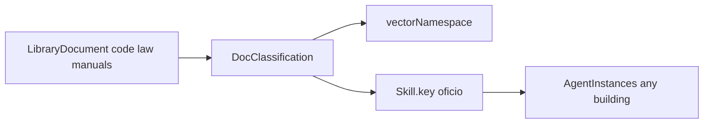
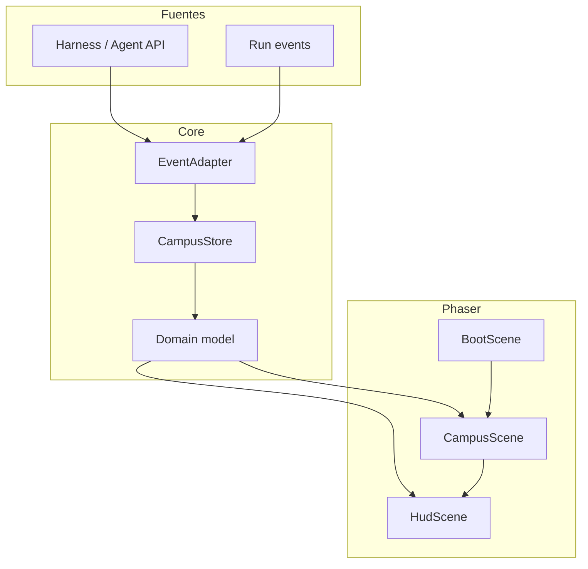
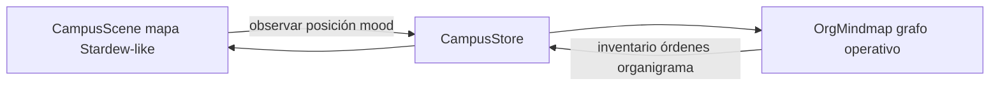

# Agent Campus — Spec técnica (engine)

**Estado:** v0.8 — agentes permanecen en su oficina salvo llamada (`ProjectCall`) de otro proyecto.  
**Engine elegido:** Phaser 3 + TypeScript + Vite (web-first, pixel art 2D top-down).  
**Referencia visual:** captura pixel-RPG (edificio flotante, 2 salas + pasillo + utility).

---

## 1. Objetivo

Renderizar un **campus gamificado** donde:

- un **campus** agrupa **edificios** (proyectos) y una **biblioteca** compartida
- un **edificio** = un **proyecto**
- una **habitación** = un **departamento / oficina**
- un **agente** **no suele salir de su oficina**; solo se desplaza a otro edificio si **otro proyecto le llama**, y entonces participa en su oficina correspondiente allí
- ops = organigrama mindmap + inventario de tareas / órdenes

---

## 2. Ontología (confirmada)

```
Campus
  ├── Library
  │     ├── LibraryDocument (code | law | manual | …)
  │     └── DocClassification
  │           ├── vectorNamespace          categorización vectorial
  │           └── skillKeys[]              bind por OFICIO (cross-building)
  └── Project (= Building)
        ├── context, ranks
        └── Workspace (= Department)
              └── AgentInstance
                    └── skill.key ──────────┘ (resuelve clasificaciones)
```

### Capas de conocimiento

| Capa | Dónde | Qué aporta |
|---|---|---|
| Oficio genérico | `skill` | Craft; también **llave** a la biblioteca |
| Contexto general | `Project.context` | Quiénes somos |
| Especialización | home `Workspace.context` | Estilo/normas del dpto |
| Knobs LLM | `harness` | model / temp / effort |
| Corpus | `Library` + classifications | RAG por oficio |

Stack: `craft ⊕ currentBuilding ⊕ correspondingOffice ⊕ harness ⊕ rank ⊕ libraryClassifications(skill.key)`.

**Siempre razona como su oficio.** No adopta la especialización de una sala ajena por la que pase.

### Movilidad entre edificios (solo por llamada)

**Default:** el agente permanece en su oficina (`homeWorkspaceId` / `isStationedAtHome`).

**Excepción:** un `ProjectCall` de otro proyecto autoriza salir. Al aceptar:

1. `activeCallId` se setea.
2. Va al edificio llamante (`projectId = fromProjectId`).
3. Se sienta en la **oficina correspondiente** (`naturalDepartmentKey`) si existe.
4. Al cerrar la llamada → `returnHomeFromCall` (vuelve a home building + home office).

Sin `activeCallId` **no** hay roaming libre entre edificios ni entre salas.

| Concepto | Campo / API |
|---|---|
| Estación normal | `homeProjectId` + `homeWorkspaceId`, `activeCallId = null` |
| Llamada | `ProjectCall` + `project.call.issued` / `accepted` |
| En destino | `agent.building.entered` (requiere `callId`) |
| Fin | `agent.returned_home` |

Helpers: `issueProjectCall`, `acceptProjectCall`, `returnHomeFromCall`, `canLeaveHomeOffice` en [`context.ts`](../packages/campus-engine/src/domain/context.ts).

### Departamento natural (homing)

- Tras intro: homing a la oficina home.
- Tras llamada: oficina correspondiente en el proyecto llamante; al terminar, vuelta a home.



| Regla | Decisión |
|---|---|
| Ámbito | Biblioteca **de campus** (compartida entre edificios) |
| Material | `DocKind`: code, law, manual, policy, research, other |
| Clasificación | Taxonomía → `vectorNamespace` (categorización vectorial / RAG) |
| Asociación a agentes | Por **`skillKeys`** (oficio), no por instance id |
| Mismo oficio, distintos edificios | Comparten las mismas classifications / namespaces |
| Sala | Opcional `role: "library"` + `Library.roomId` en el mapa |

Helpers: [`domain/library.ts`](../packages/campus-engine/src/domain/library.ts). Sample: [`sample-library.json`](../packages/campus-engine/src/catalog/sample-library.json).

### Departamento natural (homing)

- `naturalDepartmentKey` → `homeWorkspaceId` si el dpto existe.
- Tras intro, **homing** al dpto natural (salvo `stayInRoom`).

### Organigrama, debate y evaluación

| Regla | Decisión |
|---|---|
| Debate | Solo mismo rango |
| Sin saltar jerarquía | Solo peers o supervisor/report directo |
| Evaluación | Solo supervisor directo |
| Jefe de dpto | `Workspace.headAgentId` |

Helpers: [`domain/org.ts`](../packages/campus-engine/src/domain/org.ts).

### Reglas v0

| Regla | Decisión |
|---|---|
| Salas | = departamentos (+ library room opcional) |
| Homing | Oficina home; tras llamada, oficina homologa en destino |
| Movilidad inter-edificio | **Solo** vía `ProjectCall` — no salen de oficina por defecto |
| Razonamiento | Siempre oficio; building/dept = actuales correspondientes |
| Biblioteca | Campus-scoped; bind por `Skill.key` |
| Harness / org / debate / eval | Como v0.4 |
| Persistencia | Data-driven |

---

## 3. Stack

| Capa | Tecnología | Motivo |
|---|---|---|
| Runtime 2D | **Phaser 3** | Tilemaps, sprites, cámaras, depth sorting, web nativo |
| Lenguaje | **TypeScript** | Tipado del modelo de dominio ↔ escena |
| Bundler | **Vite** | HMR rápido para iterar tiles/sprites |
| Mapas | **Tiled** → JSON (`tilemap`) + manifest propio de habitaciones | Edición visual de salas sin redeploy de lógica |
| Estado remoto | WebSocket (o SSE) → `CampusStore` | Actualización live de agentes/runs |
| Host UI | Embed en página web (canvas fullscreen o panel) | Producto web, no binario desktop |

**Alternativas descartadas (por ahora):**

- Godot: peor DX para embed en dashboard web.
- React-only DOM: no encaja con tilemaps/pixel depth.
- Pixi solo: más trabajo manual de cámara/colisiones/tilemap que Phaser ya resuelve.

---

## 4. Arquitectura



### Capas

1. **Domain** — tipos puros (`AgentArchetype`, `AgentInstance`, `Skill`, `Project`, …). Cero Phaser.
2. **CampusStore** — fuente de verdad en cliente; catálogo + instancias; aplica eventos idempotentes.
3. **EventAdapter** — mapea eventos externos → `agent.instantiated`, `agent.moved`, …
4. **Scenes Phaser** — solo proyección: leen el store, no deciden negocio.
5. **HudScene** — catálogo modal, barras, tooltips, selección; parte de UI puede ser DOM sobre el canvas.

---

## 5. Modelo de datos

Fuente canónica: [`packages/campus-engine/src/domain/types.ts`](../packages/campus-engine/src/domain/types.ts).  
Home/contexto: [`context.ts`](../packages/campus-engine/src/domain/context.ts).  
Org rules: [`org.ts`](../packages/campus-engine/src/domain/org.ts).  
Catálogo / proyecto: `sample-catalog.json`, `sample-project.json`.

### 5.1 Contexto, harness, organigrama, biblioteca e instancias

```ts
interface Campus { id; name; libraryId; projectIds }
interface Library { id; campusId; name; roomId? }
interface DocClassification {
  key; label; vectorNamespace; skillKeys: string[]; // bind por oficio
}
interface LibraryDocument { title; kind: DocKind; classificationIds; sourceUri? }

interface HarnessParams { model: string; temperature: number; effort: number; maxTokens?: number }
interface Rank { id: Id; key: string; label: string; level: number }

interface AgentArchetype {
  skill: Skill;
  naturalDepartmentKey: string;
  defaultRankKey: string;
  defaultHarness: HarnessParams;
}

interface Project {
  campusId: Id;
  context: BuildingContext;
  ranks: Rank[];
  campusLeadAgentId?: Id;
}

interface Workspace {
  key: string;
  context: DepartmentContext;
  headAgentId?: Id;
}

interface AgentInstance {
  harness: HarnessParams;
  rankKey: string;
  supervisorId: Id | null;
  homeWorkspaceId: Id | null;
  skill: Skill; // skill.key → library classifications
}

interface DebateSession { participantIds: Id[]; topic: string; status: "open" | "closed" }
interface TaskEvaluation { runId; evaluatorId; assigneeId; verdict }
```

### 5.2 Layout del edificio (asset + metadata)

Separar **geometría** (Tiled) de **semántica** (manifest):

```ts
interface BuildingLayout {
  id: string;
  tilemapUrl: string;          // assets/maps/project-alpha.json
  tilesetUrl: string;
  rooms: RoomDef[];
  anchors: AnchorDef[];        // podio, sillas, desk, utility terminal
  portraits: PortraitSlot[];   // marcos del pasillo
}

interface RoomDef {
  id: string;
  workspaceKey?: string;       // bind a Workspace.key
  rect: { x: number; y: number; w: number; h: number }; // en tiles
  entrances: { x: number; y: number }[];
  carpetTint?: string;
}

interface AnchorDef {
  id: string;
  roomId: string;
  kind: "podium" | "seat" | "desk" | "terminal" | "stand";
  x: number;
  y: number;
  facing?: "up" | "down" | "left" | "right";
}

interface PortraitSlot {
  id: string;
  x: number;
  y: number;
  bind: "agent" | "workspace" | "run"; // TBD
}
```

El layout de la captura de referencia se modela así:

| Room | `workspaceKey` (ejemplo) | `role` |
|---|---|---|
| Left lecture | `briefing` / `mkt` | `briefing` |
| Right ops | `dev` / `ops` | `ops` |
| Bottom hall | `_hallway` | `hallway` |
| Left machine alcove | `_infra` | `utility` |

---

## 6. Escenas Phaser

### BootScene
- Carga tilesets, spritesheets de agentes, UI atlas (bubbles, bars).
- Resuelve `BuildingLayout` del proyecto activo.

### CampusScene
- Monta tilemap.
- Spawnea `RoomZone` (debug opcional).
- Spawnea `AgentSprite` por agente; depth = `y`.
- Pathing simple: grid A* sobre capa de colisión del tilemap (pasillo ↔ salas).
- Suscripción al store: diff → tween move / change emote / update bar.

### HudScene (overlay) + DOM shell
- Acción **Añadir** por sala (botón en HUD o hotzone de la room).
- **CatalogModal** (DOM o Phaser UI): lista `AgentArchetype`, input de nombre, confirm.
- Retratos + barras del pasillo.
- Sin lógica de negocio: emite `InstantiateRequest` al store/host.

---

## 7. Agente como sprite

```ts
class AgentSprite extends Phaser.GameObjects.Container {
  // body (spritesheet 4-dir walk + idle) — key desde archetype.spriteKey
  // bubble (Mood → frame del atlas)
  // name label (visible al menos durante introduction)
  // skill chip opcional (TBD)
}
```

**Máquina de estados visual:**

```
Spawning → Introducing → Idle → Walking → OccupyingAnchor → Emoting
                                   ↘ Blocked (path fail)
```

- **Spawning:** aparece en entrada de la room o ancla libre.
- **Introducing:** `agent.introducing === true`; peers pueden mirar / emote; al acabar → Idle.
- **OccupyingAnchor:** ancla según `instance.role` + `workspace.role`; si no hay libre → stand.

---

## 8. Eventos (contrato del adapter)

```ts
type CampusEvent =
  | { type: "project.loaded"; /* … */ }
  | { type: "agent.instantiated"; agent; peerIds }
  | { type: "agent.homing"; agentId; homeWorkspaceId }
  | { type: "agent.harness.updated"; agentId; harness }
  | { type: "agent.rank.updated"; agentId; rankKey; supervisorId }
  | { type: "org.head.assigned"; workspaceId; headAgentId }
  | { type: "debate.requested" | "debate.started" | "debate.rejected" | "debate.closed"; /* … */ }
  | { type: "task.submitted_for_review"; runId; assigneeId; reviewerId }
  | { type: "task.evaluated"; evaluation: TaskEvaluation }
  | { type: "hierarchy.violation"; fromAgentId; toAgentId; action; reason }
  | { type: "library.loaded" | "library.document.upserted" | "library.classification.upserted" | "library.reindexed"; /* … */ }
  | { type: "building.context.updated" | "department.context.updated"; /* … */ }
  | { type: "run.upserted" | "run.removed"; /* … */ }
  // + introduction.*, agent.moved, agent.mood, agent.despawned, catalog.loaded, debate.*, task.*, hierarchy.*
```

El adapter traduce WS/API del harness a este set. Reglas de org y library en dominio (`org.ts`, `library.ts`), no en Phaser.

---

## 9. Superficies de interfaz (dos capas)

Hay **dos UIs**; no se mezclan responsabilidades:



### 9.1 Mapa gamificado (fase diseño — no bloquear v0)

Vista espacial tipo Stardew: globos, panel inferior, distinguir rango/oficio visualmente, etc.

- **Ahora:** no es prioritario detallar look&feel.
- El engine deja hooks (`mood`, labels, selección); el polish visual viene en fase de diseño.

### 9.2 Interfaz operativa = organigrama mindmap (primaria)

La UI **operativa** es un **grafo de organigrama** (mindmap):

- Nodos = agentes (rango, oficio, dpto).
- Aristas = reporting (`supervisorId`).
- En cada nodo: **inventario de tareas** (`AgentTask[]`).
- Acciones: **dar órdenes** (`AgentOrder`) al agente (sujeto a reglas de jerarquía si el emisor es otro agente; el humano puede ordenar según política TBD).

Profundización del mindmap: más adelante (layout, filtros, drag de tareas, etc.).

### 9.3 Inventario y órdenes (dominio ya tipado)

| Concepto | Tipo | Uso |
|---|---|---|
| Inventario de tareas | `AgentTask` | Lista por agente en el mindmap / ficha |
| Ejecución | `Run` | Progreso/estado ligado a una task |
| Orden | `AgentOrder` | Instrucción humana o de supervisor → agente |
| Eventos | `task.inventory.updated`, `order.issued`, `order.updated` | Sync store ↔ UIs |

### 9.4 Hooks visuales (mapa) — diferidos

| Superficie | Hook | Notas |
|---|---|---|
| Globos rango/oficio | sprite / bubble | Fase diseño |
| Panel inferior | HudScene | Fase diseño |
| Click agente en mapa | SelectionBus | Puede abrir ficha o saltar al nodo en mindmap |
| Biblioteca / RAG badge | libraryClassifications | Ops o ficha |
| Debate / review | debate.*, task.evaluated | Staging mínimo |

Hasta la fase de diseño: mapa = pan/zoom + sprites; ops = mindmap + inventario + órdenes.

---

## 10. Estructura de repo propuesta

```
/
  docs/TECH_SPEC.md          ← este documento
  packages/campus-engine/
    package.json
    src/
      domain/                # types, context.ts, org.ts, library.ts, tasks.ts
      catalog/sample-catalog.json
      catalog/sample-library.json
      layouts/sample-project.json
      store/CampusStore.ts
      adapter/types.ts
      game/
        main.ts
        scenes/BootScene.ts
        scenes/CampusScene.ts
        scenes/HudScene.ts
        objects/AgentSprite.ts
        systems/Pathfinding.ts
        systems/IntroductionDirector.ts
        systems/HomingSystem.ts
        systems/DebateDirector.ts
      layouts/reference-building.json
      ui/CatalogModal.ts
      ui/OrgMindmap.tsx          # interfaz operativa primaria
      ui/TaskInventoryPanel.ts
      ui/OrderComposer.ts
      ui/HarnessParamsForm.ts
      ui/LibraryPanel.ts
    public/assets/
      maps/
      sprites/
      ui/
  apps/playground/           # Vite app que embebe el engine con mock events
```

---

## 11. Layout de referencia (foto)

Coordenadas relativas (tiles, origen top-left del building AABB). Escala a ajustar al tileset real (asumir tile 16×16 o 32×32).

```json
{
  "id": "reference-dual-room",
  "rooms": [
    { "id": "room-briefing", "workspaceKey": "mkt", "role": "briefing", "carpetTint": "#c0392b" },
    { "id": "room-ops", "workspaceKey": "dev", "role": "ops", "carpetTint": "#2980b9" },
    { "id": "room-hall", "workspaceKey": null, "role": "hallway" },
    { "id": "room-infra", "workspaceKey": "_infra", "role": "utility" }
  ],
  "anchors": [
    { "id": "briefing-podium", "roomId": "room-briefing", "kind": "podium" },
    { "id": "briefing-seat-*", "roomId": "room-briefing", "kind": "seat" },
    { "id": "ops-desk", "roomId": "room-ops", "kind": "desk" },
    { "id": "ops-seat-*", "roomId": "room-ops", "kind": "seat" },
    { "id": "infra-terminal", "roomId": "room-infra", "kind": "terminal" },
    { "id": "hall-stand", "roomId": "room-hall", "kind": "stand" }
  ],
  "portraits": [
    { "id": "portrait-left", "bind": "run" },
    { "id": "portrait-right", "bind": "run" }
  ]
}
```

Rectángulos exactos se fijan al exportar el mapa Tiled a partir de la captura.

---

## 12. Criterios de aceptación v0

1. Dominio v0.5 (contexto, org, library, harness) estable.
2. `AgentTask` inventario por agente; `AgentOrder` emitible vía eventos.
3. `OrgMindmap` (aunque sea wireframe) lista nodos por `supervisorId` + tasks del nodo.
4. Mapa Phaser: spawn/homing básico; **sin** requisito de polish Stardew.
5. Domain testable con Vitest.

---

## 13. Fuera de alcance v0

- Diseño visual de globos/panel inferior (fase diseño).
- Mindmap avanzado (auto-layout rico, drag-drop de tasks) — se profundiza después.
- Provider real de embeddings / LLM.
- Multiplayer humano, combate, economía.

---

## 14. Próximos inputs necesarios (cuando quieras)

1. **Órdenes humanas** — ¿el humano salta jerarquía o debe “hablar” como campus lead?
2. **Ingestión biblioteca** — ¿humano, CI, agentes?
3. **Catálogo** — ¿global o filtrado por dpto/rank?
4. **Scaffold** — ¿empezamos por domain+mindmap wireframe o por mapa Phaser?
