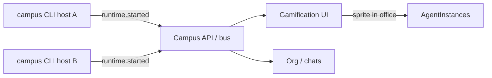
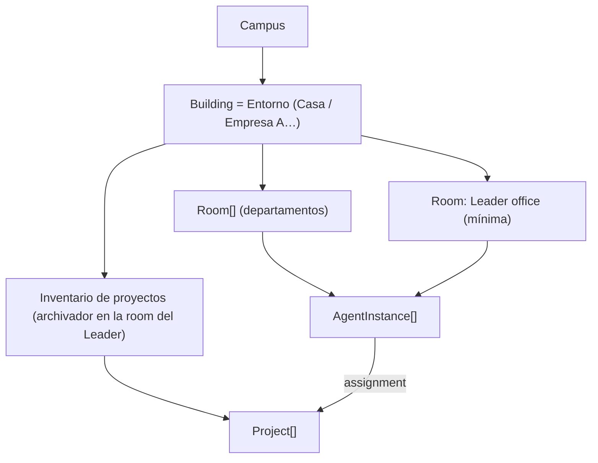
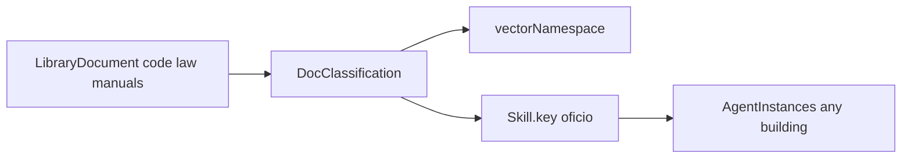
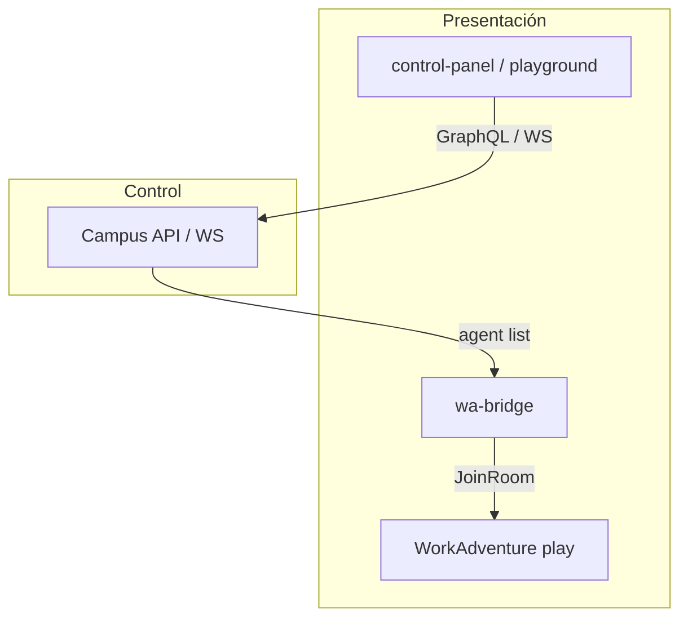
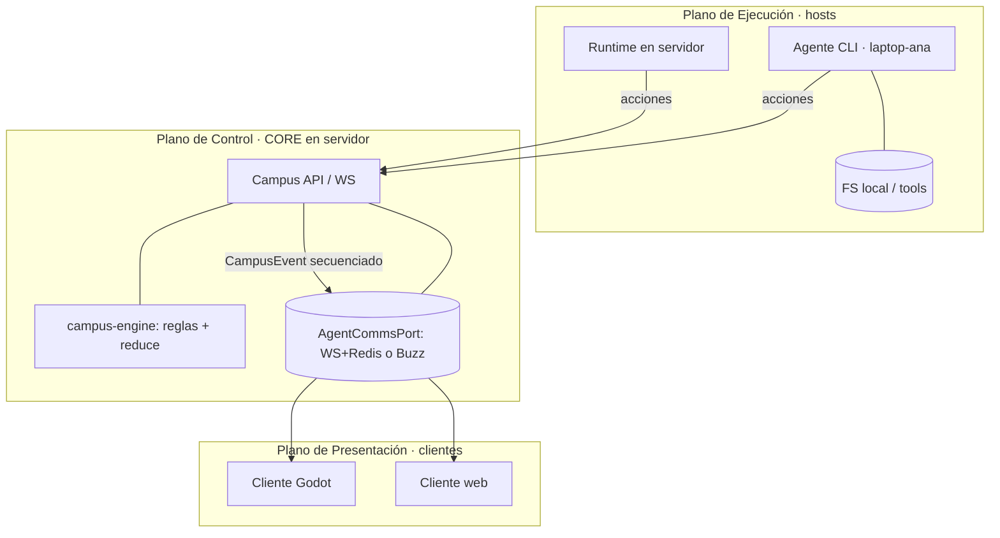
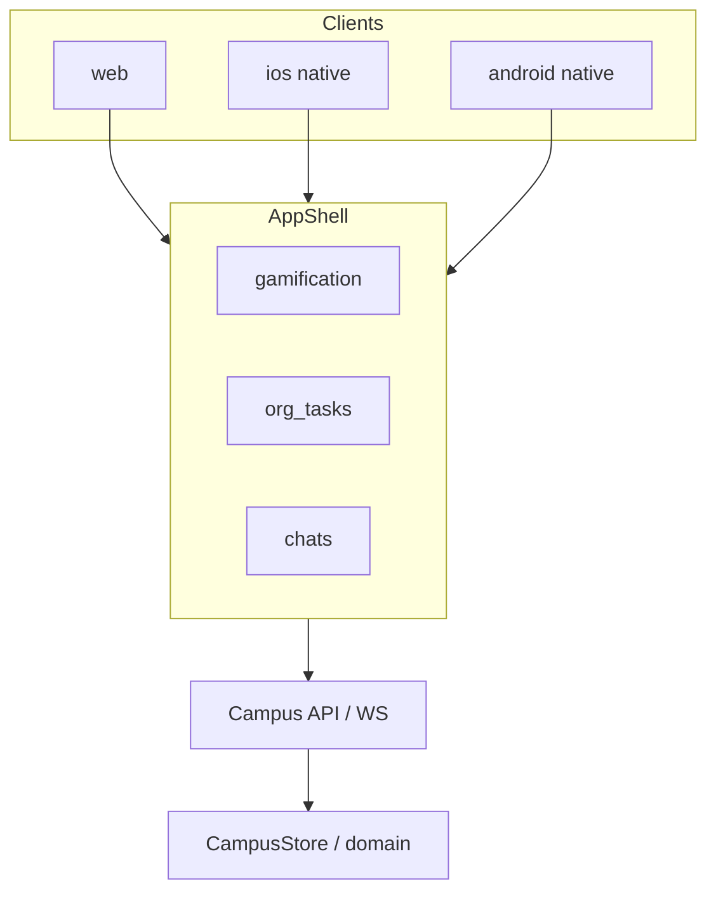

# Agent Campus — Spec técnica (engine)

**Estado:** v0.17 — **Presentación espacial = WorkAdventure** (+ [`engine/apps/wa-bridge`](../engine/apps/wa-bridge)).  
**Cliente espacial canónico:** WorkAdventure (play).  
**Dominio:** TypeScript `campus-engine` + API.  
**UI no espacial:** control-panel / playground.  
**Godot (`~~engine removed: campus-godot~~`): DEPRECATED** — solapaba el mapa espacial con WA; ver [`docs/WORKADVENTURE.md`](WORKADVENTURE.md).  
**Backend:** dominio TS + API Hono + MemPalace + Spec Kit + Compose.  
**CLI host:** diferido (prioridad baja).  

> Nota histórica: v0.16 asumía Godot 4 Stardew-like como app principal. Esa línea queda deprecada; no nuevas features de mapa en Godot.

---

## 1. Objetivo

Producto con **tres ámbitos / pantallas** (en **web y mobile nativo**):

1. **Gamificación** — mapas de campus/building/room; workers anónimos entrar/salir.
2. **Organigrama / tareas** — mindmap; inventario; órdenes.
3. **Chats con agentes** — hilos con instancias nombradas.

Dominio compartido: campus → edificios → oficinas; `ProjectCall`; biblioteca; workers; MemPalace; Spec Kit; **hosts CLI** que hacen vivir agentes en máquinas remotas y los **representan** en su oficina.

### CLI host distribuido (`campus`) — prioridad baja

> **Prioridad baja.** El contrato existe (`domain/host.ts`) para no pintar una esquina, pero **no bloquea** scaffold de web/mobile, memoria, Spec Kit ni compose. Se implementa después del MVP de pantallas + API.

El sistema permitirá **instalar un CLI** en cualquier máquina para:

1. **Conectarse** al campus (`campus login` / `host join`).
2. **Instanciar** agentes con rol/oficio/harness (`agent spawn`).
3. **Mantenerlos vivos** (proceso runtime en esa máquina).
4. **Representarlos** en el mapa/org en su lugar justo (oficina natural / building).




| Concepto       | Tipo                                   | Notas                                         |
| -------------- | -------------------------------------- | --------------------------------------------- |
| Host           | `AgentHost`                            | Máquina/proceso unido al campus               |
| Runtime        | `AgentRuntime`                         | Proceso vivo de un `AgentInstance` en un host |
| Representación | `hostId` + `runtimeId` en la instancia | Mapa coloca el sprite en la oficina del rol   |
| Plataforma     | `ClientPlatform = "cli_host"`          | Junto a web/ios/android                       |


Comandos (contrato): ver `CAMPUS_CLI_COMMANDS` en `[domain/host.ts](../engine/packages/engine/src/domain/host.ts)`.

Eventos: `host.joined` / `host.left` / `host.heartbeat` / `runtime.started` / `runtime.stopped`.

Reglas:

- Un agente **vivo** tiene `runtimeId` + `hostId`; sin runtime aparece offline / no “habita” la oficina.
- Spawn respeta catálogo, rank, homing y `ProjectCall` igual que desde la UI.
- Varios hosts pueden correr roles distintos (p. ej. GPU box = systems eng; laptop = UX).
- Al caer el host: `runtime.stopped` → sprites salen o pasan a idle offline (TBD visual).
- Workers anónimos también pueden spawnearse desde un host `ic` y verse entrar/salir.


### Clientes: WorkAdventure espacial (+ UI web)

| Plataforma | Cómo |
| ---------- | ---- |
| **Espacial (mapa, WOKAs)** | **WorkAdventure** + `engine/apps/wa-bridge` — canónico |
| **Config / overview** | `engine/apps/control-panel`, `apps/playground` |
| **~~Godot mobile/desktop/web~~** | **DEPRECATED** — no invertir |

Las pantallas de **mapa / gamificación espacial** viven en WA. Org/tasks/config: web (control-panel) + eventos del core. Detalle: [`WORKADVENTURE.md`](WORKADVENTURE.md).

### Memoria (MemPalace) — agente y proyecto

Base: [MemPalace](https://github.com/MemPalace/mempalace).


| MemPalace       | Agent Campus                                                                 |
| --------------- | ---------------------------------------------------------------------------- |
| Palace          | Campus (`memoryPalaceRef`)                                                   |
| Wing (proyecto) | `Project.memoryWingId` ?? `project.id` — **memoria compartida del edificio** |
| Wing (agente)   | opcional privado = `agent.id`                                                |
| Room            | `_general` | `naturalDepartmentKey` | topic                                  |
| Drawer          | `MemoryDrawer` verbatim                                                      |


| Corpus            | Ámbito          | Uso                                          |
| ----------------- | --------------- | -------------------------------------------- |
| Library           | Oficio / campus | Docs RAG                                     |
| MemPalace agent   | Instancia       | Chat, handoffs personales                    |
| MemPalace project | Edificio        | Decisiones, contexto compartido del proyecto |


Recall efectivo: `recallScopesForAgent` → agent + project + department rooms.  
Eventos: `memory.remembered`, `memory.project.remembered`, `memory.recalled`.

### Spec Kit (SDD por proyecto)

Base: [github/spec-kit](https://github.com/github/spec-kit).

Cada **proyecto/edificio** puede activar Spec-Driven Development:

`constitution → specify → plan → tasks → implement → converge`  
(+ extensions `bug`, `assess`).


| Spec Kit                 | Agent Campus                                      |
| ------------------------ | ------------------------------------------------- |
| `specify init`           | `Project.specKit` en el building                  |
| Phases `/speckit-*`      | `ProjectSpecKit.phase` + `SpecKitArtifact`        |
| Convergence              | `convergence: diverged | in_progress | converged` |
| Agents implementan tasks | Órdenes / runs ligados a artifacts                |


Eventos: `speckit.phase.changed`, `speckit.artifact.upserted`.  
Helpers: `[domain/speckit.ts](../engine/packages/engine/src/domain/speckit.ts)`.

### Comunicación entre agentes + despliegue

Tomamos del [Buzz compose](https://github.com/block/buzz/tree/main/deploy/compose) (hive mind / relay):


| De Buzz                        | En Agent Campus                                       |
| ------------------------------ | ----------------------------------------------------- |
| `relay` + WS event log         | `api` + **bus de eventos** (`CampusEvent`)            |
| Postgres + Redis + MinIO       | Igual (estado, pub/sub, library blobs)                |
| `run.sh` + `.env` + Caddy TLS  | `[deploy/compose/](../deploy/compose/)`               |
| Agentes como miembros de rooms | Chats / debates / orders / calls en canales scoped    |
| Opción futura Nostr/Buzz       | `CAMPUS_COMMS_BACKEND=buzz` + `CAMPUS_BUZZ_RELAY_URL` |


Puerto: `[domain/comms.ts](../engine/packages/engine/src/domain/comms.ts)` — `AgentCommsPort.publish/subscribe` por `campus|project|workspace|agent|thread`.

No vendemos Buzz entero en v0; reutilizamos el **patrón de ops** y dejamos el relay Buzz como backend opcional de comms.

---


## 2. Ontología (confirmada)

> **Revisión conceptual (2026-08-29): `Building` = `Entorno`, no proyecto.** Un building es un
> **entorno** (p. ej. *Casa*, *Empresa A*, *Empresa B*). El **proyecto** deja de ser el building:
> ahora **vive dentro** del building como un **inventario/archivador de proyectos** en la **room
> del líder (Leader)**. Ver §2.0. Las menciones antiguas de "Project (= Building)" quedan
> **superadas** y se reconcilian por capas.

```
Campus
  ├── Library + MemPalace palace
  └── Building (= Entorno: Casa, Empresa A, Empresa B…)
        ├── context, leaderAgentId
        ├── memoryWingId              memoria compartida del entorno
        ├── specKit                   Spec-Driven Development
        ├── Room (mín.: Leader office) → AgentInstance
        └── Project[]                 inventario de proyectos (archivador en la room del Leader)
                                      ↕ assignment: AgentInstance ↔ Project
```

### 2.0 Concepto: Building = Entorno; el Proyecto vive dentro

- **Building = Entorno.** Un contenedor con identidad propia (Casa, Empresa A, Empresa B…). No es
  un proyecto.
- **Room mínima: Leader office.** Todo building tiene, como mínimo, la **oficina del líder (Leader)**.
- **Inventario de proyectos.** El building tiene un **contenedor** (tipo *inventario de juego* /
  archivador) donde **viven los proyectos**. Conceptualmente ese archivador está en la **room del
  Leader**.
- **Project (nueva sub-entidad).** El proyecto pasa a ser una entidad **dentro** del building
  (`Project { id, buildingId, name, … }`), guardada en el inventario. Ya **no** equivale al
  building.
- **Assignment agente ↔ proyecto.** Un agente puede ser **asignado** a un proyecto; al asignarlo,
  el proyecto **aparece en el agente** (se refleja en su representación). Cardinalidad asumida:
  **N:N** (un proyecto puede tener varios agentes; un agente puede estar en varios proyectos) —
  [PENDIENTE confirmar si se restringe].



**Implicaciones (se reconcilian en sus capas, no ahora):**

- `ProjectCall` deja de ser "préstamo entre proyectos/edificios" y pasa a ser **préstamo entre
  entornos (buildings)**; el "proyecto" ya no es la unidad de préstamo (revisar en su capa).
- La **memoria de proyecto** (`memory` scope `project`, `ownerId = buildingId`) hoy es realmente
  **memoria de entorno**; la memoria por-proyecto (si se quiere) será scope aparte cuando exista
  la entidad `Project`.
- Capas de dominio nuevas a planificar: **`Project` (entidad + inventario del building)** y
  **`assignment` (agente ↔ proyecto)**. La capa de building en curso se reenfoca a "entorno"
  (context + Leader office + lead).


### Capas de conocimiento


| Capa             | Dónde                       | Qué aporta                               |
| ---------------- | --------------------------- | ---------------------------------------- |
| Oficio genérico  | `skill`                     | Craft; también **llave** a la biblioteca |
| Contexto general | `Building.context` (entorno) | Quiénes somos                           |
| Especialización  | home `Workspace.context`    | Estilo/normas del dpto                   |
| Knobs LLM        | `harness`                   | model / temp / effort                    |
| Corpus           | `Library` + classifications | RAG por oficio                           |


Stack: `craft ⊕ currentBuilding ⊕ correspondingOffice ⊕ harness ⊕ rank ⊕ libraryClassifications(skill.key)`.

**Siempre razona como su oficio.** No adopta la especialización de una sala ajena por la que pase.

### Movilidad entre edificios (solo por llamada)

**Default:** el agente permanece en su oficina (`homeWorkspaceId` / `isStationedAtHome`).

**Excepción:** un `ProjectCall` de otro proyecto autoriza salir. Al aceptar:

1. `activeCallId` se setea.
2. Va al edificio llamante (`projectId = fromProjectId`).
3. Se sienta en la **oficina correspondiente** (`naturalDepartmentKey`) si existe.
4. Al cerrar la llamada → `returnHomeFromCall` (vuelve a home building + home office).

Sin `activeCallId` **no** hay roaming libre entre edificios ni entre salas.


| Concepto        | Campo / API                                                |
| --------------- | ---------------------------------------------------------- |
| Estación normal | `homeProjectId` + `homeWorkspaceId`, `activeCallId = null` |
| Llamada         | `ProjectCall` + `project.call.issued` / `accepted`         |
| En destino      | `agent.building.entered` (requiere `callId`)               |
| Fin             | `agent.returned_home`                                      |


Helpers: `issueProjectCall`, `acceptProjectCall`, `returnHomeFromCall`, `canLeaveHomeOffice` en `[context.ts](../engine/packages/engine/src/domain/context.ts)`.

### Departamento natural (homing)

- Tras intro: homing a la oficina home.
- Tras llamada: oficina correspondiente en el proyecto llamante; al terminar, vuelta a home.




| Regla                             | Decisión                                                       |
| --------------------------------- | -------------------------------------------------------------- |
| Ámbito                            | Biblioteca **de campus** (compartida entre edificios)          |
| Material                          | `DocKind`: code, law, manual, policy, research, other          |
| Clasificación                     | Taxonomía → `vectorNamespace` (categorización vectorial / RAG) |
| Asociación a agentes              | Por `skillKeys` (oficio), no por instance id                   |
| Mismo oficio, distintos edificios | Comparten las mismas classifications / namespaces              |
| Sala                              | Opcional `role: "library"` + `Library.roomId` en el mapa       |


Helpers: `[domain/library.ts](../engine/packages/engine/src/domain/library.ts)`. Sample: `[sample-library.json](../engine/packages/engine/src/catalog/sample-library.json)`.

### Departamento natural (homing)

- `naturalDepartmentKey` → `homeWorkspaceId` si el dpto existe.
- Tras intro, **homing** al dpto natural (salvo `stayInRoom`).


### Organigrama, debate y evaluación


| Regla                | Decisión                               |
| -------------------- | -------------------------------------- |
| Debate               | Solo mismo rango                       |
| Sin saltar jerarquía | Solo peers o supervisor/report directo |
| Evaluación           | Solo supervisor directo                |
| Jefe de dpto         | `Workspace.headAgentId`                |


Helpers: `[domain/org.ts](../engine/packages/engine/src/domain/org.ts)`.

### Reglas v0


| Regla                         | Decisión                                                                               |
| ----------------------------- | -------------------------------------------------------------------------------------- |
| Salas                         | = departamentos (+ library room opcional)                                              |
| Homing                        | Oficina home; tras llamada, oficina homologa en destino                                |
| Movilidad inter-edificio      | **Solo** vía `ProjectCall` — no salen de oficina por defecto                           |
| Workers anónimos              | Solo **último rango** (`ic`) puede instanciar/destruir; mapa = entrar/salir del campus |
| Pantallas                     | `gamification` | `org_tasks` | `chats`                                                 |
| Razonamiento                  | Siempre oficio; building/dept = actuales correspondientes                              |
| Biblioteca                    | Campus-scoped; bind por `Skill.key`                                                    |
| Memoria agente                | MemPalace drawers (episódica)                                                          |
| Memoria proyecto              | Wing compartido del building (`memoryWingId`)                                          |
| Spec Kit                      | SDD por proyecto (`Project.specKit`)                                                   |
| Clientes                      | `web` | `ios` | `android` | `cli_host`                                                 |
| CLI                           | Contrato listo; **prioridad baja** — post-MVP                                          |
| Pantallas                     | `gamification` | `org_tasks` | `chats`                                                 |
| Harness / org / debate / eval | Como v0.4                                                                              |
| Persistencia                  | Data-driven                                                                            |


### Workers anónimos (spawn / destroy)

- Quién: agentes de **último rango** = menor `Rank.level` → key `ic` (`WORKER_SPAWNER_RANK_KEY`).
- Qué: `AgentInstance` con `kind: "anonymous_worker"`, `spawnedById`, nombre genérico (sin ficha de catálogo propia).
- Crear → evento `worker.entered` → en el mapa: figura anónima **entra** al campus (puerta/acceso).
- Destruir → evento `worker.exited` → figura anónima **sale** del campus.
- Solo el spawner puede destruir a sus workers (`canDestroyWorker`).

Helpers: `[domain/workers.ts](../engine/packages/engine/src/domain/workers.ts)`.

---


## 3. Stack (cerrado v1 — WA espacial + core TS)


| Capa                         | Tecnología                                   | Motivo                                                 |
| ---------------------------- | -------------------------------------------- | ------------------------------------------------------ |
| **Espacial (mapa + WOKAs)** | **WorkAdventure** + `engine/apps/wa-bridge`        | Presentación espacial canónica; sin segundo motor mapa |
| Domain / API                 | **TypeScript** + **Hono** + Postgres + Redis | Reglas, bus, persistencia                              |
| Memoria                      | **MemPalace**                                | Agente + proyecto                                      |
| Specs                        | **Spec Kit**                                 | SDD por building                                       |
| Comms                        | WS + Redis (`AgentCommsPort`)                | Chats, orders, calls                                   |
| Config / admin UI            | control-panel / playground                   | Sin clonar dashboard SaaS WA                           |
| Deploy                       | `deploy/compose`                             | api, pg, redis, minio, caddy                           |
| CLI host                     | diferido                                     | Prioridad baja                                         |
| ~~Godot 4~~                  | **DEPRECATED** (`~~engine removed: campus-godot~~`)         | Solapaba espacial con WA                               |


### Por qué WorkAdventure (y no Godot) como espacial

- WA ya resuelve multiplayer, WOKAs, proximidad, zones, Jitsi/Matrix.
- Un segundo cliente Stardew/Godot duplicaba exactamente esa finalidad.
- Org/tasks siguen en el core + UI web; embodiment de agentes = wa-bridge.



> Histórico: la sección “Por qué Godot como app mobile” queda obsoleta; ver v0.16 en git si hace falta.

---


---


## 4. Arquitectura — tres planos

El sistema se separa en **tres planos**. Ningún plano contiene reglas de otro.


| Plano                         | Dónde vive                                                                                        | Qué posee                                                                                                | En el repo                                                                                                      |
| ----------------------------- | ------------------------------------------------------------------------------------------------- | -------------------------------------------------------------------------------------------------------- | --------------------------------------------------------------------------------------------------------------- |
| **Control** (autoridad)       | **Core** en servidor (VPS o server local expuesto vía VPN)                                        | Identidad, org, binding a campus/edificio, memoria (punteros), reglas y **secuencia** del bus de eventos | `[campus-engine](../engine/packages/engine/src)` + API                                                          |
| **Ejecución** (cómputo)       | **Host** = cualquier máquina (el servidor, un portátil, un box GPU… incluso **headless por CLI**) | El **proceso vivo** del agente + acceso a **archivos/carpetas locales** y tools de esa máquina           | `[domain/host.ts](../engine/packages/engine/src/domain/host.ts)` (`AgentHost`, `AgentRuntime`, `CampusCliPort`) |
| **Presentación** (proyección) | **Cliente** espacial = WorkAdventure; UI web = control-panel / playground | Solo **renderiza** / proyecta; no decide negocio | `engine/apps/wa-bridge` + WA play; `engine/apps/control-panel`, `apps/playground`; ~~`~~engine removed: campus-godot~~` deprecated~~ |





> Los **archivos/carpetas son host-local, no del core**. El core guarda solo una referencia/manifiesto (qué host, `workingDir`, scopes concedidos), nunca los bytes. El host ejecuta con acceso real: el core **autoriza** (`AgentHost.allowedSkillKeys/allowedRankKeys`) y el host **sandboxea** (`workingDir`).


### 4.1 Las tres "vidas" de un agente (no confundir)

- **Agent (identidad)** → plano control. Vive en el core (`AgentInstance`).
- **Runtime (ejecución)** → plano ejecución. Vive en un host (`AgentRuntime.hostId`). Es el "proceso de la máquina" que lo alimenta y le da acceso a ficheros.
- **Sprite (proyección)** → plano presentación. Uno por cliente conectado.

Relación: `1 Agent → 0..1 Runtime → 0..N Sprites`. Semillado en `AgentInstance.hostId` / `runtimeId`:

- `hostId/runtimeId = null` → **representado pero dormido** (catálogo/suspendido; en el mapa, "no vivo").
- seteados → **vivo**, alimentado por ese host.

Instanciar por CLI (host headless, sin cliente gráfico):

```
campus login --url <core> --token <…>
campus host join --label laptop-ana
campus agent spawn --archetype systems-eng --project <edificio> --rank ic
```


### 4.2 Autoridad y contrato: Command vs Event

- **Command** (cliente/host → core): *petición*. El core la valida contra el dominio y **puede rechazarla**.
- **Event** (`CampusEvent`, core → clientes): *hecho consumado y secuenciado*. Es lo único que ven los clientes.

El **core es el único punto de verdad y de ordenación**: nada es canónico hasta que el core lo acepta y le asigna secuencia; por eso todos los clientes convergen al mismo estado en el mismo orden. El contrato `CampusEvent` es **neutral de lenguaje** (JSON serializable) → cualquier cliente (Godot/GDScript, web/TS, CLI) lo consume sin compartir código; solo el core y los clientes TS reutilizan además el `campus-engine`.

### 4.3 Flujo runtime → core → clientes

El runtime (p. ej. un agente CLI) emite **dos tipos** de acciones:

1. **Eventos de actividad** (hechos ya ocurridos en su máquina) → el core registra y reemite tal cual: `run.upserted` (progreso), `agent.mood`, `agent.moved`, `task.inventory.updated`, lecturas de su `workingDir`…
2. **Comandos gobernados** (tocan reglas del campus) → el core los valida y puede vetarlos; el cliente ve el **resultado**, no la petición: `spawnWorker` (solo `ic`), `order`/comunicación (`canCommunicate`), `debate` (peers), `callToBuilding` (préstamo). El core responde con el evento de hecho (`worker.entered`) **o** el de rechazo (`worker.spawn.rejected`, `hierarchy.violation`).

En ambos casos, a los clientes **siempre** les llega un `CampusEvent` secuenciado por el core; el cliente nunca distingue si el origen fue un agente CLI, otro humano o el propio servidor.

**Proyección robusta:** el cliente aplica `reduce(state, event)` (`[CampusStore](../engine/packages/engine/src/store/CampusStore.ts)`), que es **idempotente** (reintentos/duplicados no rompen estado). Un cliente que entra tarde **reproduce** el event log (`getEventLog()`) —o recibe snapshot + cola— y llega al mismo estado.

### 4.4 Campus multi-edificio y préstamos

El campus es **multi-edificio**: `campus → buildings[] (Project) → rooms (Workspace)`. El `CampusStore` es **campus-scoped** y expone una **fachada de comandos por entidad**:

```
store.campus.load(...)
store.building.spawn(...) / building.updateContext(...)
store.room.spawn(...) / room.assignHead(...) / room.updateContext(...)
store.agent.spawn(...) / order(...) / callToBuilding(...) / returnHome(...)
store.worker.spawn(...) / despawn(...)
```

**Préstamo sin duplicar:** un `ProjectCall` mueve la **representación** (`projectId`/edificio), **no la ejecución** (`hostId`). Un agente que corre en `laptop-ana` puede ser prestado Demo→Beta y **sigue vivo en el mismo portátil, con los mismos ficheros**; solo cambia el edificio donde se le representa y su *contexto efectivo* (razona como su oficio, pero con el contexto del edificio destino).

### 4.5 Regla de diseño

> **El runtime propone; el core dispone; los clientes proyectan.**
> Producción de eventos = host/runtime. Autoridad + orden + reglas = core. Render = clientes.


### 4.6 Pendiente al implementar el plano de ejecución (host)

- Añadir a `HostSpawnRequest`/`AgentRuntime` el **scope de recursos**: `workingDir` + rutas permitidas (hoy `host.ts` no lo tiene).
- Confirmar **un runtime por agente** y que un agente no esté vivo en dos hosts a la vez.
- Eventos de ciclo de vida en el bus: `host.joined/left/heartbeat`, `runtime.started/stopped/dead`.

---


## 5. Modelo de datos

Fuente canónica: `[engine/packages/engine/src/domain/types.ts](../engine/packages/engine/src/domain/types.ts)`.  
Home/contexto: `[context.ts](../engine/packages/engine/src/domain/context.ts)`.  
Org rules: `[org.ts](../engine/packages/engine/src/domain/org.ts)`.  
Catálogo / proyecto: `sample-catalog.json`, `sample-project.json`.

### 5.1 Contexto, harness, organigrama, biblioteca e instancias

```ts
interface Campus { id; name; libraryId; projectIds }
interface Library { id; campusId; name; roomId? }
interface DocClassification {
  key; label; vectorNamespace; skillKeys: string[]; // bind por oficio
}
interface LibraryDocument { title; kind: DocKind; classificationIds; sourceUri? }

interface HarnessParams { model: string; temperature: number; effort: number; maxTokens?: number }
interface Rank { id: Id; key: string; label: string; level: number }

interface AgentArchetype {
  skill: Skill;
  naturalDepartmentKey: string;
  defaultRankKey: string;
  defaultHarness: HarnessParams;
}

// NOTA (revisión §2.0): este interfaz describe el ENTORNO, que ahora se llama Building.
// El "Project" pasa a ser una sub-entidad dentro del building (inventario en la room del Leader),
// con su propia interfaz (se define en su capa). Se reconcilia el naming por capas.
interface Building {            // antes "Project (= Building)"; ahora Building = Entorno
  campusId: Id;
  context: BuildingContext;     // "quiénes somos" / normas del entorno
  leaderAgentId?: Id;           // líder del entorno (Leader, agente auto-creado con el building)
}
// El rango NO cuelga del entorno: es una etiqueta libre en el agente (agent.rankKey,
// p. ej. "leader"/"ic"/"lead"). Un escalafón formal, si se quiere, vivirá en el Project o el
// Campus, no en el Building.

// Nueva sub-entidad: vive en el inventario del building (room del Leader).
interface Project {
  id: Id;
  buildingId: Id;               // entorno al que pertenece
  name: string;
  // assignment N:N con AgentInstance (el proyecto aparece en el agente asignado)
}

interface Workspace {
  key: string;
  context: DepartmentContext;
  headAgentId?: Id;
}

interface AgentInstance {
  harness: HarnessParams;
  rankKey: string;
  supervisorId: Id | null;
  homeWorkspaceId: Id | null;
  skill: Skill; // skill.key → library classifications
}

interface DebateSession { participantIds: Id[]; topic: string; status: "open" | "closed" }
interface TaskEvaluation { runId; evaluatorId; assigneeId; verdict }
```


### 5.2 Layout del edificio (asset + metadata)

Separar **geometría** (Tiled) de **semántica** (manifest):

```ts
interface BuildingLayout {
  id: string;
  tilemapUrl: string;          // assets/maps/project-alpha.json
  tilesetUrl: string;
  rooms: RoomDef[];
  anchors: AnchorDef[];        // podio, sillas, desk, utility terminal
  portraits: PortraitSlot[];   // marcos del pasillo
}

interface RoomDef {
  id: string;
  workspaceKey?: string;       // bind a Workspace.key
  rect: { x: number; y: number; w: number; h: number }; // en tiles
  entrances: { x: number; y: number }[];
  carpetTint?: string;
}

interface AnchorDef {
  id: string;
  roomId: string;
  kind: "podium" | "seat" | "desk" | "terminal" | "stand";
  x: number;
  y: number;
  facing?: "up" | "down" | "left" | "right";
}

interface PortraitSlot {
  id: string;
  x: number;
  y: number;
  bind: "agent" | "workspace" | "run"; // TBD
}
```

El layout de la captura de referencia se modela así:


| Room                | `workspaceKey` (ejemplo) | `role`     |
| ------------------- | ------------------------ | ---------- |
| Left lecture        | `briefing` / `mkt`       | `briefing` |
| Right ops           | `dev` / `ops`            | `ops`      |
| Bottom hall         | `_hallway`               | `hallway`  |
| Left machine alcove | `_infra`                 | `utility`  |


---


## 6. Escenas del cliente (plano de presentación)

> **Plano de presentación** (§4): solo proyecta estado; no decide negocio.  
> **Espacial canónico = WorkAdventure** (+ `engine/apps/wa-bridge`).  
> `apps/playground` / control-panel = UI no espacial.  
> **Godot espacial deprecated** — las escenas BootScene / CampusScene / HudScene siguientes son **legado histórico** (no roadmap). Ver [`WORKADVENTURE.md`](WORKADVENTURE.md).


### BootScene

- Carga tilesets, spritesheets de agentes, UI atlas (bubbles, bars).
- Resuelve `BuildingLayout` del edificio activo.


### CampusScene

- Monta tilemap del edificio activo.
- Spawnea `RoomZone` (debug opcional).
- Spawnea un sprite por agente **presente en el edificio** (`agent.projectId`); depth = `y`.
- Pathing simple: grid A* sobre capa de colisión del tilemap (pasillo ↔ salas).
- Suscripción al stream de `CampusEvent`: diff → tween move / change emote / update bar.


### HudScene (overlay) + shell

- Acción **Añadir** por sala.
- **CatalogModal**: lista `AgentArchetype`, input de nombre, confirm.
- Retratos + barras del pasillo.
- Sin lógica de negocio: emite **Commands** (`agent.spawn`, `agent.order`, …) al core.

---


## 7. Agente como sprite (proyección)

Renderer-agnóstico (Godot `Node2D`/`Control`, o `Container` en el cliente web). El sprite es **solo proyección** de `AgentInstance`:

```
Sprite(agent):
  body   // spritesheet 4-dir walk + idle — key = archetype.spriteKey
  bubble // Mood → frame del atlas
  label  // nombre (visible al menos durante introduction)
  chip?  // skill opcional (TBD)
  alive? // hostId/runtimeId != null → "vivo" (alimentado por un host)
```

**Máquina de estados visual:**

```
Spawning → Introducing → Idle → Walking → OccupyingAnchor → Emoting
                                   ↘ Blocked (path fail)
```

- **Spawning:** aparece en entrada de la room o ancla libre.
- **Introducing:** `agent.introducing === true`; peers pueden mirar / emote; al acabar → Idle.
- **OccupyingAnchor:** ancla según `instance.role` + `workspace.role`; si no hay libre → stand.

---


## 8. Eventos (contrato del adapter)

```ts
type CampusEvent =
  | { type: "project.loaded"; /* … */ }
  | { type: "agent.instantiated"; agent; peerIds }
  | { type: "agent.homing"; agentId; homeWorkspaceId }
  | { type: "agent.harness.updated"; agentId; harness }
  | { type: "agent.rank.updated"; agentId; rankKey; supervisorId }
  | { type: "org.head.assigned"; workspaceId; headAgentId }
  | { type: "debate.requested" | "debate.started" | "debate.rejected" | "debate.closed"; /* … */ }
  | { type: "task.submitted_for_review"; runId; assigneeId; reviewerId }
  | { type: "task.evaluated"; evaluation: TaskEvaluation }
  | { type: "hierarchy.violation"; fromAgentId; toAgentId; action; reason }
  | { type: "worker.entered" | "worker.exited" | "worker.spawn.rejected"; /* … */ }
  | { type: "library.loaded" | "library.document.upserted" | "library.classification.upserted" | "library.reindexed"; /* … */ }
  | { type: "building.context.updated" | "department.context.updated"; /* … */ }
  | { type: "run.upserted" | "run.removed"; /* … */ }
  // + introduction.*, agent.moved, agent.mood, agent.despawned, catalog.loaded, debate.*, task.*, hierarchy.*, project.call.*
```

El adapter traduce WS/API del harness a este set. Reglas en dominio del core (`org.ts`, `library.ts`, `workers.ts`), **nunca en el cliente**.

---


## 9. Tres pantallas × tres clientes




| #   | Pantalla             | Mobile notes                                         |
| --- | -------------------- | ---------------------------------------------------- |
| 1   | Gamificación         | Tab/full-screen; touch pan/zoom; workers enter/leave |
| 2   | Organigrama / tareas | Primaria en phone; mindmap simplificado + listas     |
| 3   | Chats                | Primaria en phone; push al recibir mensajes/órdenes  |


`ClientPlatform` no cambia reglas de org/memoria/spec — solo shell y notificaciones.

### 9.1 Gamificación + app Godot

- Un solo proyecto Godot: mapa Stardew + UI org/chats (mobile-first).
- Exports: iOS, Android, Web.
- `worker.entered` / `runtime.started` / pathing en TileMap.
- Refs isométricas = layout modular, no art final.


#### Referente: esquematización de departamentos en un edificio (fuerte)

Asset: `[assets/refs/building-departments-schematic-isometric.png](../assets/refs/building-departments-schematic-isometric.png)`

**Preferido** para la vista de un **edificio (= proyecto)** y sus oficinas:


| Elemento visual                               | Lectura Agent Campus                                               |
| --------------------------------------------- | ------------------------------------------------------------------ |
| Plataformas flotantes isométricas             | Departamentos / workspaces (smart classroom, study, ops…)          |
| Hub central con racks                         | Memoria de proyecto (MemPalace wing) + / o biblioteca del building |
| Líneas teal de red                            | Flujos: `ProjectCall`, shared memory, datos entre dptos            |
| Pantallas / dashboards en salas               | Runs, tasks, Spec Kit status del dpto                              |
| Figuras en mesas                              | AgentInstances en su oficina                                       |
| Iconos periféricos (cloud, collab, materials) | Integraciones / library / chats — no bloquean el layout            |


Estilo: tech-modern, azules/teals, grid limpio, modular. Encaja web y mobile (plataformas → cards en phone).

Convive con el diorama clay (campus entero) y el pixel top-down (layout de salas). Art final sigue abierto.

#### Referente estético campus (orientativo)

Asset: `[assets/refs/aesthetic-campus-isometric-clay.png](../assets/refs/aesthetic-campus-isometric-clay.png)` — diorama beige monocromo; útil para sensación de “campus objeto”, no para el esquema interno de dptos.

### 9.2 Organigrama / tareas

- Grafo mindmap (`supervisorId`).
- Inventario `AgentTask[]`, órdenes `AgentOrder`.
- Spawn/destroy de workers también puede dispararse desde aquí (si el actor es `ic`); el mapa solo lo representa.


### 9.3 Chats con agentes

- Hilos por `AgentInstance` nombrado (workers anónimos: TBD si tienen chat propio o solo via spawner).
- Tipado de mensajes: pendiente de profundizar; evento mínimo futuro `chat.message` (no bloquea v0).


### 9.4 Inventario / órdenes / workers


| Concepto       | Tipo / evento                         |
| -------------- | ------------------------------------- |
| Task inventory | `AgentTask`, `task.inventory.updated` |
| Orden          | `AgentOrder`, `order.issued`          |
| Worker in      | `worker.entered`                      |
| Worker out     | `worker.exited`                       |
| Reject spawn   | `worker.spawn.rejected`               |


---


## 10. Estructura de repo propuesta

```
/
  docs/TECH_SPEC.md
  docs/WORKADVENTURE.md       # WA vs campus-engine; Godot deprecated
  deploy/compose/
  engine/packages/engine/     # domain TS (API + clients)
  packages/campus-cli/        # low priority
  engine/apps/wa-bridge/             # embodiment espacial → WorkAdventure
  engine/apps/control-panel/         # config UI
  apps/playground/            # proyección web de debug
  ~~engine removed: campus-godot~~/          # DEPRECATED — no nuevas features espaciales
```

---


## 11. Layout de referencia (foto)

Coordenadas relativas (tiles, origen top-left del building AABB). Escala a ajustar al tileset real (asumir tile 16×16 o 32×32).

```json
{
  "id": "reference-dual-room",
  "rooms": [
    { "id": "room-briefing", "workspaceKey": "mkt", "role": "briefing", "carpetTint": "#c0392b" },
    { "id": "room-ops", "workspaceKey": "dev", "role": "ops", "carpetTint": "#2980b9" },
    { "id": "room-hall", "workspaceKey": null, "role": "hallway" },
    { "id": "room-infra", "workspaceKey": "_infra", "role": "utility" }
  ],
  "anchors": [
    { "id": "briefing-podium", "roomId": "room-briefing", "kind": "podium" },
    { "id": "briefing-seat-*", "roomId": "room-briefing", "kind": "seat" },
    { "id": "ops-desk", "roomId": "room-ops", "kind": "desk" },
    { "id": "ops-seat-*", "roomId": "room-ops", "kind": "seat" },
    { "id": "infra-terminal", "roomId": "room-infra", "kind": "terminal" },
    { "id": "hall-stand", "roomId": "room-hall", "kind": "stand" }
  ],
  "portraits": [
    { "id": "portrait-left", "bind": "run" },
    { "id": "portrait-right", "bind": "run" }
  ]
}
```

Rectángulos exactos se fijan al exportar el mapa Tiled a partir de la captura.

---


## 12. Criterios de aceptación v0

1. Dominio: org, library, workers, memory, specKit, comms, **host/runtime**.
2. `campus host join` + `agent spawn` emiten eventos y asignan `hostId`/`runtimeId`.
3. UI mapa representa el agente en su oficina al `runtime.started`.
4. Host down → `runtime.stopped`.
5. Mismo contrato en web/ios/android/cli_host.
6. Domain testable (Vitest) sin canvas.

---


## 12.b Premisas de desarrollo


### Semántica de producto

- **Task con test-gate.** Una task solo se da por hecha si **pasa su verificación**. Ciclo: `queued → running → under_review → succeeded` (o `needs_revision`), evaluada por el supervisor directo (`org.ts::canEvaluate` / `TaskEvaluation`). **"Hecho" = 100% de lo ordenado + test en verde.**
- **Worker = bucle acotado hasta el 100%.** Un `anonymous_worker` ejecuta un **bucle no infinito** (con límite de iteraciones/guard) que itera **hasta cumplir al 100%** la task indicada; al converger, **sale** (`worker.exited`). No es un proceso perpetuo: nace para una tarea, la completa y muere. Alinea con `SpecKitConvergenceStatus` (`diverged → in_progress → converged`) y con `RunStatus`.
- **Subprocesos detallados.** Cada orden se descompone en subprocesos verificables; cada subproceso se testea de forma independiente.


### Disciplina de ingeniería

- **Cada unidad se testea** antes de cerrarla (Vitest en dominio/store; prueba manual en cliente).
- **Coherencia estructural:** un patrón por capa — dominio puro, **fachada por entidad** en el store (`building/room/agent/worker/…`), reducer puro idempotente, clientes solo proyección.
- **Sin código espagueti:** reglas solo en el core; cero lógica de negocio en clientes; helpers puros reutilizables.
- **Refactor periódico ("cada x"):** consolidar/limpiar de forma recurrente para no acumular deuda; extraer/renombrar cuando un patrón se repite.

---


## 12.c Protocolo de ramas — una rama por spec

Flujo alineado con Spec Kit (SDD): **una spec = una rama = un PR**.


| Paso     | Acción                                                                                                         |
| -------- | -------------------------------------------------------------------------------------------------------------- |
| Abrir    | Al entrar en fase `specify`, se crea una rama dedicada a esa spec.                                             |
| Trabajar | `specify → plan → tasks → implement` ocurren **en esa rama**; no se acumulan specs distintas en la misma rama. |
| Cerrar   | Fase `converge` = spec cerrada → **tests en verde** → PR a `main` (ready).                                     |
| Integrar | **Merge a** `main` tras revisión/CI. `main` es la integración estable.                                         |


- **Naming** (agente cloud): `cursor/spec-<slug>-7599` (prefijo `cursor/`, sufijo `-7599` obligatorios en este entorno).
- **Señal de cierre**: la fase `converge` del Spec Kit del edificio es el gate para test + merge.
- **Merge**: lo realiza un humano tras revisión (el agente solo mergea con permiso explícito).

---


## 13. Fuera de alcance v0

- Binario CLI publicado en npm (solo contrato + package path).
- Orquestación k8s multi-host.
- Wire runtime MemPalace/Buzz completo.
- Art final.

---


## 14. Próximos inputs necesarios (cuando quieras)

1. ~~Scaffold Godot~~ — **cerrado**: Godot espacial deprecated; WA + wa-bridge.
2. MotionMotor extensible en wa-bridge (directivas move/say/hold).
3. Org/tasks UI: profundizar control-panel / playground (no mapa paralelo).
4. Admin API opcional si Pusher debe preguntar a campus.
5. Limpieza: borrar o archivar `~~engine removed: campus-godot~~` cuando toque.

---


## 15. Visión de producto (futuro, no v0)

**SaaS multi-tenant "Campus as a Service".** El usuario **adquiere campus y los gestiona** (crear/borrar campus, invitar miembros, conectar hosts, límites de uso). Encaja con el modelo de 3 planos: el **core** ya es la autoridad multi-campus (`Campus.projectIds`), los **hosts** aportan cómputo del cliente y los **clientes** solo proyectan.

- **Tiers / pricing**: TBD (p. ej. nº de campus/edificios, hosts conectados, agentes vivos, retención de memoria).
- **Aislamiento**: cada tenant = uno o varios campus; identidad y facturación por cuenta.
- **No v0**: se documenta como norte de producto; no bloquea el MVP (pantallas + API + host/runtime).

### 15.1 CLI como "elemento" conectable al campus (norte)

El **CLI** (base [opencode](https://github.com/opencode-ai/opencode)) es un **elemento del plano
de ejecución** que el usuario **conecta al campus** (host) y, una vez dentro, opera de tres formas:

- **Chat**: conversar con el/los agentes vivos en ese host.
- **Crons**: programar tareas recurrentes que el agente ejecuta solo (el scheduler vive en el
  host/CLI y emite comandos al core; la ejecución respeta el test-gate).
- **Indexar documentos**: leer ficheros locales del host y volcarlos a la biblioteca/memoria del
  campus (RAG por oficio).

El **core sigue siendo la autoridad**; el CLI aporta cómputo local (runtime del agente), acceso a
ficheros (indexado) y UI de terminal (chat/crons). Encaja en los tres planos y reutiliza el dominio:

| Capacidad CLI | Pieza del dominio |
|---|---|
| Conectar/mantener vivo | `host.join` + `runtime.start` (§host/runtime) |
| Chat agente↔usuario | **añadido de dominio pendiente**: `chat.message` (comando/evento) |
| Crons → tareas | scheduler local → `task.assign/start/submit/evaluate` (test-gate) |
| Indexar docs | `library.addClassification/addDocument` + `memory.remember` |

**Orden sugerido cuando se retome**: (1) capa de dominio `chat`; (2) extender el CLI (base
opencode) con chat interactivo; (3) crons e indexado de documentos. **No v0.**

### 15.2 Control Panel / admin (futuro)

App de configuración del campus/servidor: **idioma**, **zona horaria del servidor**, **token de
conexión** (auth de hosts/CLI/MCP — hoy diferida) y otros ajustes. Consumirá la capa de conexión
(GraphQL para config/queries; MCP para tools). **No v0.**

**Proveedores y modelos de IA para los agentes.** El Control Panel gestiona:

- **Catálogo de proveedores** (OpenAI, Anthropic, local/Ollama…) con sus **credenciales/keys**
  (secretos, junto al token/auth — nunca en el estado del campus).
- **Modelos disponibles** por proveedor y **defaults** (por campus y/o por edificio/entorno).
- El agente selecciona de ese catálogo vía su `harness` (`HarnessParams { model, temperature,
  effort, maxTokens? }`, §5.1): el Control Panel define *qué existe y con qué credenciales*; el
  agente/edificio elige *cuál usa*.

Domain angle (cuando toque su capa): comando `agent.setHarness` + catálogo de modelos como estado
de config; las keys quedan fuera del `CampusState` (secretos del servidor). **No v0.**

