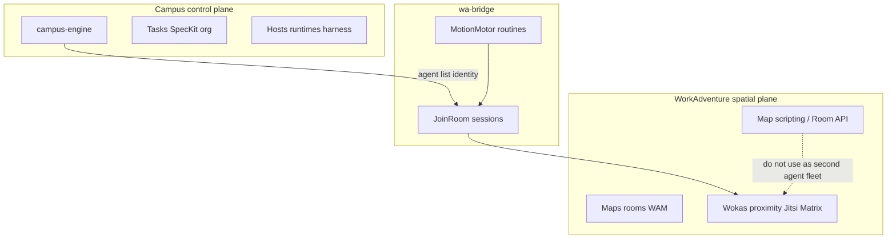

# WorkAdventure — docs & hallazgo

## Canonical docs

- Online: [https://docs.workadventu.re/](https://docs.workadventu.re/)
- Local vendor copy: [`workadventure/docs/`](../workadventure/docs/)

Indexed in codebase-memory:

| Project | Path |
|---------|------|
| **`workadventure-docs`** | `workadventure/docs/` (map/scripting; admin SaaS **not** fully here) |
| **`workadventure-admin-docs`** | [`docs/workadventure-admin/`](./workadventure-admin/) — [docs.workadventu.re/admin/](https://docs.workadventu.re/admin/) |
| **`workadventure-blog-docs`** | [`docs/workadventure-blog/`](./workadventure-blog/) — [docs.workadventu.re/blog/](https://docs.workadventu.re/blog/) tutorials |

Query map/scripting via `workadventure-docs`; admin via `workadventure-admin-docs`; bot/scripting tutorials via `workadventure-blog-docs`.

---

## Spatial contract (direction — specs 047 / 049)

| Campus concept | WorkAdventure | Core field |
|---|---|---|
| **Building** | **Map** (WAM / room URL) | `Building.waRoomUrl` |
| **Room** | **Private area** in the map editor | `Room` id (+ optional `waAreaId`) |
| **Agent embodiment** | WOKA via `engine/apps/wa-bridge` / `wa-mcp` | — |
| **Ops / tools** | MCP over bridge + map-storage | [`wa-mcp-feasibility.md`](./wa-mcp-feasibility.md) |

`Appearance` on building/room is **deprecated** (Godot-era); WA owns geometry.

---

## campus-engine vs WorkAdventure (no duplicar el dominio)

**Veredicto:** WorkAdventure **no** reemplaza [`engine/packages/engine`](../engine/packages/engine). Hay solape en *presentación espacial* — y ese solape se resuelve **deprecando Godot como cliente espacial**, no metiendo el dominio en WA.



### Matriz de propósito

| | **campus-engine** | **WorkAdventure** |
|--|-------------------|-------------------|
| Propósito | Autoridad: campus, edificios, rooms, agentes, workers, tasks/test-gate, Spec Kit, ProjectCall, hosts/runtimes, event bus | Mundo espacial: mapas, WOKAs, proximidad, Jitsi/LiveKit, Matrix, zones |
| Contrato | Command → Event secuenciado; clientes proyectan | Front ↔ Pusher ↔ Back; Admin API opcional; map scripts |
| Identidad agente | `AgentInstance` + oficio/rank/supervisor/harness | Member/visitor/anon + tags; bot = script o sesión |
| Ejecución LLM/ficheros | Plano host (`runtime` / CLI) | No; bots del blog viven en **script de mapa** |
| Clientes | playground / control-panel (UI no espacial) | **Cliente espacial canónico** (play WA) |

### Godot — **deprecated**

[`~~engine removed: campus-godot~~`](../~~engine removed: campus-godot~~) queda **deprecado**. La finalidad última del cliente espacial (mapa, avatares, proximidad) es exactamente lo que aporta WA; mantener una segunda línea Stardew/Godot duplica presentación.

| Antes (TECH_SPEC v0.16) | Ahora |
|-------------------------|--------|
| Godot 4 = cliente principal (mapa + org + chats) | **WA + wa-bridge** = representación gráfica/espacial |
| Godot mobile/desktop/web | WA play (browser); org/config en control-panel / playground |
| `~~engine removed: campus-godot~~` activo | No nuevas features; no specs nuevas de mapa Godot |

Código legado puede permanecer en el repo hasta borrarlo en una limpieza; **no invertir** en pathing/skins/campus_view Godot.

### No usar WA para (sí-campus)

- Organigrama, órdenes, Spec Kit, test-gate
- Multi-edificio + `ProjectCall` (representación ≠ ejecución)
- Harness / providers (control-panel)
- Event log / proyección multi-cliente
- Hosts remotos con ficheros locales

### Sí usar WA para (sí-WA)

- Representar agentes en un mapa multiplayer (**única** proyección espacial)
- Proximidad social / Jitsi / zonas (con cuidado)
- Chat humano-humano (Matrix) si se activa

### Solape a evitar (presentación)

1. ~~Segundo mapa Stardew en Godot~~ → **deprecado**; no competir con WA.
2. **Flota doble de bots:** map-script GPT/Tock *y* sesiones `wa-bridge`.
3. **Tres chats sin rol:** campus `chat.send` = negocio/órdenes; burbuja WA = color local; Matrix = humano-humano.

### Regla de embodiment (única)

**Un solo camino:** [`engine/apps/wa-bridge`](../engine/apps/wa-bridge) — JoinRoom + MotionMotor/routines. Campus decide *quién* existe; el bridge *proyecta* WOKAs.

- No adoptar a la vez bots del [blog WA](./workadventure-blog/) (gpt-bot, tock-bot, realtime-api) como segunda flota de agentes del campus.
- Tutoriales de scripting = referencia de UX/API, no arquitectura de dominio.
- Movimiento de alta frecuencia **nunca** al event bus del core (directivas en el bridge).

### Admin

Control Panel campus ≠ clonar dashboard SaaS WA. Admin API (`/api/map`, `/api/room/access`, `/api/woka/list`) solo si Pusher debe preguntar a campus. Ver [workadventure-admin](./workadventure-admin/README.md).

---

## Vendor — submodule (read-only)

`workadventure/` is a **git submodule** pinned to release tag **`v1.33.5`**.

**Hard rule: do not edit files under `workadventure/`.** No map patches, no compose forks, no core changes in-tree. Updates = bump the submodule to a newer upstream tag. Map ops use the **map editor** / **map-storage HTTP API** via scripts in this monorepo (`scripts/wa/`), never by committing into the submodule.

```bash
git submodule update --init
cd workadventure
docker compose -f docker-compose.yaml -f docker-compose-no-oidc.yaml up -d
```

---

## Admin dashboard (for Control Panel)

See [`workadventure-admin/README.md`](./workadventure-admin/README.md).

## Google Calendar add-on (hallazgo)

- Marketplace: [WorkAdventure for Google Workspace](https://workspace.google.com/marketplace/app/workadventure/513915283499)
- Docs: [Google Calendar](https://docs.workadventu.re/integrations/google-calendar)
- `meetingRoomLabel` en meeting-rooms.md

**Constraint:** no disponible en self-hosted WA.

## Related product decisions

- Agent movement: extend MotionMotor in `engine/apps/wa-bridge` (not high-frequency core events).
- Prefer map-storage / editor over hand-editing starter `map.json` in the submodule.
- Godot spatial client: **deprecated** (see above).

## Inline map editor (dev, no OIDC)

Requirement: room URL under **`/~/...`** (map-storage), plus `ENABLE_MAP_EDITOR` + `MAP_EDITOR_ALLOW_ALL_USERS=true` (set by `docker-compose-no-oidc.yaml`). Anonymous access is enough in this mode.

```bash
git submodule update --init
cd workadventure
docker compose -f docker-compose.yaml -f docker-compose-no-oidc.yaml up -d
cd ..
bash scripts/wa/upload-starter-to-map-storage.sh
```

- Editor room: http://play.workadventure.localhost/~/campus/starter/map.wam  
- Bridge default `WA_ROOM_URL` points there (`engine/apps/wa-bridge`).  
- Inline edits persist in map-storage (`.wam`), not in submodule `maps/starter/map.json`. For tile geometry: edit with Tiled **outside** the submodule or via editor → re-run the upload script.

## Visual demo (shared map)

```bash
# One-shot: upload map + core + graphql + wa-bridge + panel
bash scripts/wa/demo-visual.sh
# or without upload:
bash scripts/wa/stack-up.sh
bash scripts/wa/stack-down.sh   # wipe campus procs + logs (not WA Docker)
```

Open: http://play.workadventure.localhost/~/campus/starter/map.wam (anonymous).  
Panel: http://localhost:5174/  
Seed defaults to **shared** map (`WA_SEED_MAP_MODE=shared`) so the whole named fleet appears in one room. Use `per-building` after uploading `~/b-alpha` etc.
